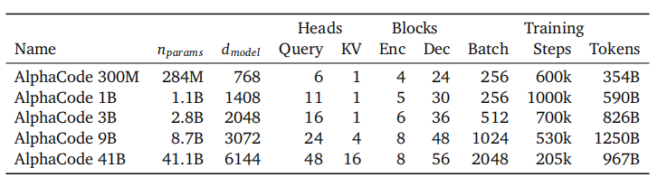
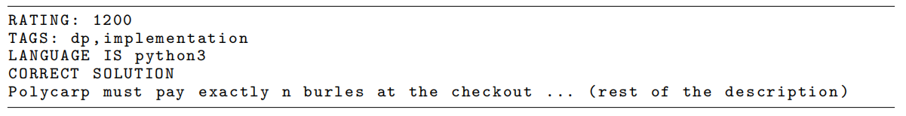

# AlphaCode：用大规模代码生成攻克编程竞赛

> AlphaCode 是 DeepMind 提出的代码生成系统，旨在解决编程竞赛这一极具挑战性的任务。它不依赖单次"灵光一闪"，而是通过百万级候选生成、多阶段筛选和聚类选择，在 Codeforces 竞赛中达到了约前 54% 的人类参赛者水平。

## 评估方法：n@k 与 pass@k

在代码生成领域，有两种常用的评估指标。

**pass@k** 是 Codex 使用的指标：模型为一个问题生成 $k$ 个候选代码，只要其中至少有一个能通过所有测试用例，就算该问题"通过"。pass@k 的最终值是模型在整个测试集上"通过"的问题占比。

**n@k** 是 AlphaCode 使用的指标，含义更进一步：模型可以生成很多候选程序（比如 1000 个），然后通过去重、过滤、排序得到一系列候选解。n@k 衡量的是在前 $k$ 个提交里，至少有 $n$ 个是正确的概率。n@k 越高，说明模型生成的前 $k$ 个候选中正确解的覆盖率越好。

## 评估平台与数据集

DeepMind 选择 **Codeforces** 作为评估平台，理由包括：竞赛题目质量高，能真实反映解决复杂问题的能力；所有参赛者面对相同的全新题目，保证公平性；有大量真实人类参赛者可供排名比较。

为保证评估的公正性，DeepMind 特意挑选了 10 场在 AlphaCode 训练数据截止日期之后举办的 Codeforces 竞赛，确保模型面对的是全新的、从未"学习"过的问题。

## 训练流程

### 阶段一：通用预训练——GitHub 代码库

数据来源是一个精选的公开 **GitHub** 代码库快照，规模达 715.1 GB。数据集涵盖多种主流编程语言，包括 C++、C#、Go、Java、JavaScript、Lua、PHP、Python、Ruby、Rust、Scala 和 TypeScript。

在这个阶段，模型通过预测代码中的下一个 token 进行自监督学习，从而内化代码的语法结构、常见算法实现、库函数用法等通用编程知识。

### 阶段二：专项微调——CodeContests 数据集

**CodeContests** 数据集汇集了来自 Codeforces、CodeChef、AtCoder、Aizu、HackerEarth 等知名编程竞赛平台的题目。数据集包含完整的信息：

- **问题描述**：用自然语言写成的题目，包含背景、输入输出格式、约束条件等
- **人类提交的代码**：既有正确解（accepted），也有错误解（incorrect），让模型同时学习什么是好代码、什么是坏代码
- **测试用例**：包括公开测试用例和隐藏测试用例

简而言之，GitHub 预训练让模型成为知识渊博的"通才"程序员；CodeContests 微调则将其训练为专注的"编程竞赛选手"，学会将自然语言问题转化为高效、正确的算法代码。

## 模型框架

AlphaCode 使用 **Transformer 编码器-解码器**架构，但在细节上有所不同：

- Q、K、V 维度不同于原始 Transformer（K 的维度更大）
- 编码器堆叠层数较少，解码器堆叠层数较多（因为生成代码比理解题意更难）
- 编码器序列更长，解码器序列更短（题面通常比代码长约 2 倍）

## 微调阶段的改进

### 低温度采样

使用较小的温度 $T = 0.2$。较小的温度会放大模型原始概率之间的差异，使概率最高的 token 几乎成为唯一选择，增强确定性、降低随机性。这对于需要预测较长序列的场景尤为重要，能让输出分布更加 sharp。

### 混合损失函数：引入正确性信号

AlphaCode 的一大创新是在微调中利用了代码的正确性标签。

**语言建模损失（LM Loss）**：与 Codex 相同，预测下一个 token：

$$\mathcal{L}_{LM} = -\sum \log P_\theta(token_i | context)$$

这保证模型生成语法正确、风格合理的代码，但无法区分"正确解"和"错误解"。

**分类损失（Cls Loss）**：引入二分类任务，给定题目描述和代码解答，判定是否正确（1）或错误（0），使用**二元交叉熵**：

$$\mathcal{L}_{cls} = -\big(y \log P_\theta(correct) + (1 - y) \log(1 - P_\theta(correct))\big)$$

**融合方式**：采用多任务学习（multi-task learning）思路，两个损失加权结合：

$$\mathcal{L}_{total} = \mathcal{L}_{LM} + \lambda \mathcal{L}_{cls}$$

其中 LM Loss 保证生成的代码流畅、语法正确，Cls Loss 保证代码更可能"解对题"，$\lambda$ 用来平衡两者。

这就像给学生一个"错题本"——模型不仅学习优秀范例，也通过分析错误答案理解常见陷阱和错误模式，从而在生成时主动规避。

### Reranker：判别模型

除了在生成模型中引入分类信号，AlphaCode 还单独训练了一个 **reranker**（判别模型）：

- 输入：题目描述 + 候选解
- 输出：预测该候选解是否正确
- 训练目标：标准分类损失

这个 reranker 在推理阶段起到二次过滤/排序的作用。

### 生成与判别的结合方式

AlphaCode 并不是将判别模型 $D$ 的 loss 直接加到生成模型 $G$ 的 loss 上（不像 GAN 那样对抗训练），而是采用**后处理式结合**：

1. **候选生成**：主模型 $G$ 用高温采样生成大量候选代码（几十万条）
2. **执行测试**：在沙盒中运行代码，利用 public test cases 剔除明显错误的解
3. **判别打分**：判别模型 $D$ 对剩余候选解打分，预测"正确"的概率
4. **最终挑选（n@k）**：根据 $D$ 的分数 + 测试通过情况，挑选前 $k$ 个最可能正确的解提交

## 候选答案的生成策略

在生成候选时，AlphaCode 采用多种增加多样性的手段：

- **随机化元数据标签**：比如将语言从 Python 换成 C++，调整 RATING 值等
- **使用较高的温度**（实际也不算很大）来增加输出多样性
- **直接用 Softmax 预测**下一个词的输出。作者尝试过 Top-k 和核采样，但效果提升不大，可能是因为需要预测的序列较长，本身已具备不错的多样性

## 候选代码的筛选流程

1. **大量生成候选解**：主模型针对一个问题生成百万级别的候选程序，通过随机采样和多样化解码策略避免重复
2. **筛选无效/重复代码**：去重（移除语法上完全相同或功能等价的重复程序），编译/运行检查（剔除语法错误、无法编译的程序）
3. **公开测试过滤**：用题目提供的公开测试样例初步检验，不通过的直接丢弃。但公开样例较少，不能作为最终判断
4. **聚类与多样性选择**：为避免剩余代码全是同一种思路的小变体，AlphaCode 使用 embedding + 聚类方法——将程序映射到向量空间，在向量空间中做聚类，从每个簇中挑出代表性代码，保证提交的解法具有多样性
5. **提交策略**：优先提交最大簇的代表，最终从聚类后的集合中选择若干程序提交，由比赛的隐藏测试数据检验，最大化通过概率

## 总结

AlphaCode 的成功是一个大规模、多阶段的筛选与优化过程：

- **大规模生成**：利用庞大的 Transformer 模型，针对一个问题生成数百万个多样化的候选程序
- **过滤**：使用示例测试用例快速淘汰约 99% 语法错误或逻辑不符的无效代码
- **聚类**：对剩余代码进行聚类分析，将功能相似的代码归为一类，最大的簇很可能包含正确的解题思路
- **选择与提交**：从最有代表性的簇中挑选最多 10 个候选方案进行最终提交

AlphaCode 在模拟编程竞赛中平均排名超过约 54% 的人类参赛者，且解决的是全新的、训练数据中从未见过的问题——它必须创造新颖的解决方案，而非简单地搜索和复制已有代码。
