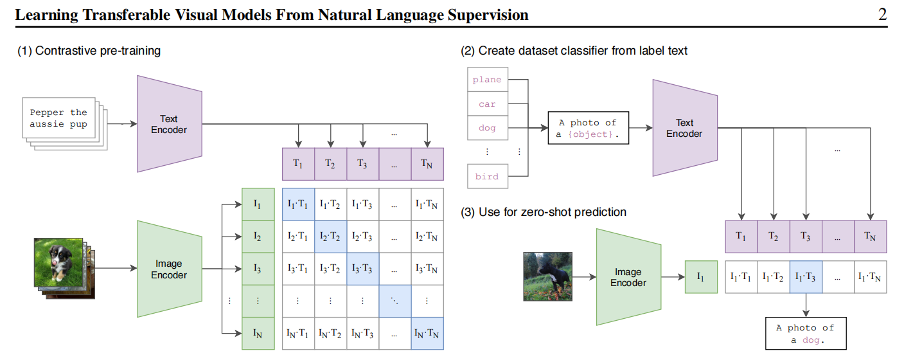
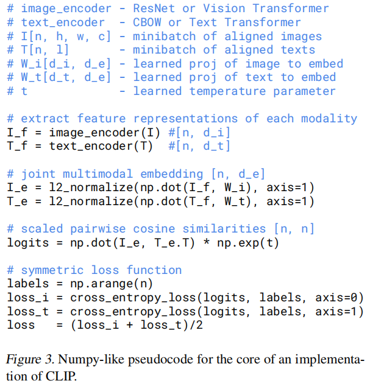
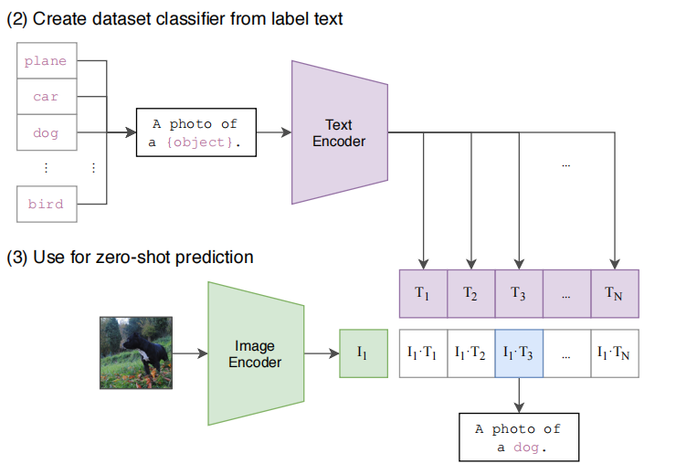

# CLIP：用自然语言监督信号学习可迁移的视觉模型

> **CLIP**（Contrastive Language-Image Pre-training，对比语言-图像预训练）是 OpenAI 于 2021 年发布的里程碑式研究成果。该模型从互联网上海量的图文配对数据中学习，将自然语言与视觉信息联系起来，在多项任务上展现出强大的**零样本学习**（Zero-Shot Learning）能力，对后续多模态 AI 的发展产生了深远影响。

## 摘要

CLIP 的核心思想是：通过一个简单且可扩展的预训练任务，在各种图像分类任务上取得极具竞争力的零样本表现。

该预训练任务利用了互联网上大量带有自然语言描述的图像数据。模型包含一个**图像编码器**和一个**文本编码器**，通过对比学习进行训练，目标是准确预测一批数据中哪些图像与哪些文本是配对的。

通过这种方式，CLIP 学会了将视觉概念与其自然语言名称相关联。训练完成后，它可以通过自然语言指令执行几乎任意的视觉分类任务，而无需针对特定任务进行额外训练或微调。实验证明，这种方法的计算效率远高于传统的监督学习方法。

## 引言：为什么需要 CLIP

CLIP 的引言首先指出了当时深度学习在计算机视觉领域的核心问题：**模型性能严重依赖于昂贵且有限的人工标注数据集**。像 ImageNet 这样的大型数据集虽然推动了领域发展，但其类别是固定的、预先定义的，导致模型难以泛化到未见过的视觉概念。

与之形成鲜明对比的是，自然语言处理（NLP）领域已经通过在海量网络文本上进行预训练取得了巨大成功。GPT 系列模型从原始文本中捕捉丰富的世界知识，展现出强大的零样本任务执行能力。

受此启发，CLIP 的作者提出了一个关键问题：**能否将"从网络规模的原始数据中学习"的成功范式应用到计算机视觉？**

答案是肯定的。互联网上存在海量公开可用的图文配对数据，这些文本描述为图像提供了丰富多样的监督信号。尽管文本描述通常较为"嘈杂"（不完全准确），但其数量和多样性足以弥补质量上的不足。

CLIP 的解决方案是：通过一个简单的**对比学习**任务，从数亿个图文对中学习预测正确的图像-文本配对。大规模训练后，模型能够学习到视觉概念与自然语言之间的强大关联，其零样本迁移能力在多种任务上表现出色。

## 模型架构与训练

CLIP 选择"**预测配对**"而不是"预测文本"，是一个化繁为简的巧妙设计——牺牲了生成完整句子的能力，换来了巨大的训练效率、更强的语义对齐能力，并直接实现了强大的零样本泛化能力。

上图展示了 CLIP 的三个关键阶段：

1. **对比预训练**：图像编码器和文本编码器分别将图像和文本映射到同一嵌入空间，通过对比损失学习对齐。
2. **创建分类器**：将类别标签嵌入 `"A photo of a {object}."` 模板中，通过文本编码器生成分类权重。
3. **零样本预测**：计算待分类图像与所有候选类别文本之间的相似度，选择最高分作为预测结果。

### 伪代码详解

整个训练过程可以分为四个步骤：

**第 1 步：特征提取。** 模型接收一批 $N$ 个图像和对应的 $N$ 个文本。图像编码器（ResNet 或 Vision Transformer）将每张图像处理成一个向量，文本编码器（CBOW 或 Text Transformer）将每段文本也处理成相同维度的向量。得到两组特征向量：$I_f$ 代表图像，$T_f$ 代表文本。

**第 2 步：线性投射与归一化。** 通过可学习的投射矩阵 $W_i$ 和 $W_t$ 将特征映射到联合嵌入空间，并进行 L2 归一化，使所有向量长度为 1，便于计算余弦相似度。

**第 3 步：计算余弦相似度。** 将归一化后的图像特征矩阵 $I_e$（形状 $[N, D_e]$）与转置后的文本特征矩阵 $T_e^T$（形状 $[D_e, N]$）相乘，一次性得到所有图文对的余弦相似度矩阵 $\text{logits}$（形状 $[N, N]$）：

- $\text{logits}[i, i]$（对角线元素）：正确配对的相似度
- $\text{logits}[i, j]$（$i \neq j$，非对角线元素）：错误配对的相似度

其中 $t$ 是一个**可学习的温度参数**，用于缩放相似度得分的分布。较高的温度使分布更平滑，较低的温度使分布更尖锐。

**第 4 步：计算损失函数。** 模型的目标是让正确配对（对角线）得分尽可能高，错误配对（非对角线）得分尽可能低。这本质上是一个 $N$ 分类问题，使用**交叉熵损失**（Cross-Entropy Loss）：

$$\text{loss} = \frac{\text{loss}_i + \text{loss}_t}{2}$$

- $\text{loss}_i$（图像侧损失）：对于每一行，希望对角线位置的概率最大
- $\text{loss}_t$（文本侧损失）：对于每一列，希望对角线位置的概率最大

最终损失是两个方向损失的平均值，确保图像和文本的对齐是对称的。

### 线性投射层 vs 非线性投射层

CLIP 使用了**线性投射层**，而 MoCo v2 使用了**非线性投射层**（即在投射层中加入了非线性激活函数）。

SimCLR 的研究发现，训练时使用非线性投射层能显著提高特征质量，因为它可以在计算对比损失之前过滤掉与下游任务无关的信息。CLIP 则采用了更简单的线性投射层，可能是因为其训练数据规模和模型规模远超前者，强大的编码器本身已经能提取足够好的特征。

## 零样本推理

CLIP 的零样本推理过程如下：

1. **输入图像**：例如一张狗的图片
2. **构造候选文本**：将所有类别名称嵌入模板，如 `"A photo of a dog."`、`"A photo of a cat."` 等
3. **编码**：分别获取图像特征向量和所有候选文本的特征向量
4. **计算相似度**：计算图像向量与每个文本向量的余弦相似度
5. **预测**：经过 Softmax 后，相似度最高的类别即为预测结果

## 提示工程

**提示工程**（Prompt Engineering）在 CLIP 中起着重要作用。其核心目标是创建最优的文本描述，以最准确地引导模型在多模态嵌入空间中匹配对应的图像。

### 为什么提示工程重要

直接使用类别名称（如 `dog`）作为文本输入，效果并不理想。将其嵌入一个有意义的句子模板中，效果会大幅提升。这是因为：

- **引导方向**：精确的提示能产出高度相关的匹配结果
- **控制输出格式**：可以通过提示指定匹配的上下文
- **激发特定能力**：不同的模板能引导模型关注不同方面的视觉特征
- **减少歧义**：提供明确的上下文可以减少模型的误判

### 基础模板

CLIP 最经典的基础模板是 `"A photo of a {object}."`。OpenAI 在论文中发现，使用这种句子模板比直接输入类别名称效果好得多。

CLIP 官方实现中共使用了 80 个不同的提示模板，涵盖了多种视角和风格，例如：

- `"a bad photo of a {}."`
- `"a sculpture of a {}."`
- `"a low resolution photo of the {}."`
- `"a rendering of a {}."`
- `"a bright photo of a {}."`
- `"a dark photo of the {}."`
- `"a close-up photo of a {}."`
- `"a black and white photo of a {}."`

此外，OpenAI 还针对歧义标签做了修正，例如将 `nail`（指甲/钉子歧义）改为 `metal nail`，将 `kite`（风筝/鸟类歧义）改为 `kite (bird of prey)`。

### 进阶策略

仅使用基础模板是不够的，尤其是处理细粒度分类或特定领域场景时。进阶策略包括：

1. **增加描述性细节**（Adding Descriptive Details）：在模板中加入更多上下文信息
2. **指定图像类型或风格**（Specifying Image Type/Style）：明确图像的拍摄方式或艺术风格
3. **提示集成**（Prompt Ensembling）：对多个模板的预测结果取平均，显著提升准确率

## 微调与线性探查

在评估预训练模型的特征质量时，有两种常见方法：

| 特性 | 微调（Fine-tuning） | 线性探查（Linear Probing） |
|---|---|---|
| 更新的参数 | 新输出层 + 预训练模型的部分或全部参数 | 仅新添加的线性输出层参数 |
| 预训练模型状态 | 主干网络被"解冻"（Unfrozen），参与训练 | 主干网络被完全"冻结"（Frozen），不参与训练 |
| 计算成本 | 高 | 低 |
| 训练时间 | 长 | 短 |
| 数据需求 | 相对较高，数据少易过拟合 | 相对较低，适合小数据集 |
| 对新任务的适应性 | 强，可以调整特征提取器 | 弱，依赖预训练特征的通用性 |
| 主要用途 | 在特定任务上追求最佳性能 | 快速、高效地验证预训练特征的质量 |

微调一般用于追求性能，线性探查一般用于特征质量的对比评估。CLIP 论文中的实验对比使用的是线性探查。

## 相关概念：FC、Dense、Linear 与 MLP

### 全连接层（FC / Dense / Linear Layer）

这三个术语通常可以互换使用，都指代神经网络中最基本的一种层，命名不同主要是因为历史原因和不同深度学习框架的偏好。其核心特征：

- **全连接**：该层中每一个神经元都与前一层的所有神经元相连接
- **权重矩阵**：层与层之间的连接通过权重矩阵 $W$ 和偏置向量 $b$ 实现
- **线性变换**：核心数学操作为 $y = W \cdot x + b$

### 多层感知机（MLP）

MLP（Multi-Layer Perceptron）指的是一个完整的网络结构，由多个层堆叠而成：

1. 一个输入层（Input Layer）
2. 一个或多个隐藏层（Hidden Layers）
3. 一个输出层（Output Layer）

MLP 与单个全连接层的关键区别在于：MLP 在每个隐藏层的线性变换 $W \cdot x + b$ 之后，都会应用一个**非线性激活函数**（如 ReLU、Sigmoid 或 Tanh），使网络能够学习非线性关系。

## CLIP 的局限性

| 局限性类别 | 具体表现 |
|---|---|
| 性能与任务 | 1. 细粒度识别差：难以区分相似的子类别；2. 抽象/复杂任务弱：无法进行计数、空间推理；3. 易受印刷术攻击：图片中的文字会严重误导模型；4. 依赖提示工程：零样本性能对措辞非常敏感 |
| 数据与偏见 | 1. 继承社会偏见：反映并可能放大训练数据中的种族、性别等偏见；2. 对分布外数据泛化有限：在专业或罕见领域（如医学影像）表现不佳 |
| 模型与资源 | 1. 训练成本极高：需要海量数据和计算资源；2. 推理效率可能较低：尤其是在类别数量很多时 |

## 多模态学习的三种策略

CLIP 属于多模态学习的范畴。要成功结合两个模态，通常需要设计能够捕捉跨模态关系的目标函数。以下是三种主要策略：

### 策略一：对齐的联合嵌入空间

这是目前最成功的方法，**CLIP 就是这种策略的典范**。

- **目标**：将两个模态的信息映射到同一个共享的向量空间中。语义匹配的图文对在空间中位置接近，不匹配的则相互远离
- **目标函数**：对比损失（Contrastive Loss），如 InfoNCE Loss

### 策略二：跨模态生成

一个模态作为条件，生成另一个模态。

- **图像字幕生成**（Image Captioning）：输入图像，输出描述文字。目标函数为以图像特征为条件的语言模型交叉熵损失
- **文本到图像生成**（如 DALL-E、Stable Diffusion）：输入文字，输出图像。目标函数通常是扩散模型的噪声预测损失或 GAN 的对抗损失

### 策略三：多模态融合预测

将两个模态的信息融合后完成下游任务。

- **典型任务**：视觉问答（VQA）、多模态情感分析
- **工作原理**：两个独立编码器分别提取图像和文本特征，通过融合模块（拼接、逐元素相乘、Cross-Attention 等）结合成一个特征向量，送入预测头进行最终判断
- **目标函数**：形式上可能仍是标准的交叉熵损失或均方误差损失，但优化对象是包含了跨模态融合逻辑的全新网络结构

### 选择策略时应考虑的问题

1. **最终目标**：是要对齐模态（策略一），从一个生成另一个（策略二），还是融合做决策（策略三）？
2. **数据形式**：是否拥有大量成对（Paired）数据？
3. **模型架构**：需要两个独立编码器加对比头，还是需要复杂的融合模块？
4. **目标函数**：基于以上三点，选择对比损失、生成损失，还是标准分类/回归损失？
