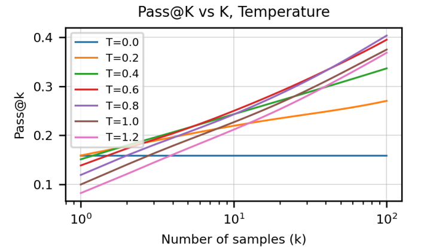

# Codex：评估在代码上训练的大型语言模型

> OpenAI 于 2021 年发布的论文《Evaluating Large Language Models Trained on Code》是 AI 代码生成领域的开创性著作。它不仅介绍了强大的代码生成模型 Codex，还提出了至今仍在广泛使用的评测标准 **HumanEval** 和核心指标 **pass@k**。

## 主要贡献

**发布 Codex 模型**：Codex 是一个基于 GPT-3 并使用从 GitHub 上公开收集的海量代码数据进行微调的大型语言模型。通过在代码上的专门训练，Codex 具备了强大的编程能力，能够理解自然语言描述（如函数文档字符串），并生成功能完整的 Python 代码。

**创建 HumanEval 评测基准**：为了科学地评估模型生成的代码是否"正确"，研究者创建了 HumanEval 数据集，包含 164 个手写编程问题，每个问题都配有单元测试用例。评测时，模型生成的代码直接通过单元测试来判断功能正确性，而非仅看代码的表面相似度。

## 模型框架

### 核心架构：Transformer Decoder-only

和当今几乎所有大型语言模型一样，Codex 的底层架构是 Transformer 模型，采用**仅解码器**（Decoder-only）的结构。这种架构擅长**自回归**（Autoregressive）任务——根据已输入或生成的文本序列，预测下一个最可能的**词元**（Token）。对于代码来说，这些词元就是变量名、关键字、运算符、括号等。模型通过一层层堆叠的自注意力（Self-Attention）机制来理解上下文中不同代码部分之间的关联，从而生成语法正确且逻辑连贯的代码。

### 基础模型：GPT-3

Codex 直接基于 GPT-3 模型家族开发，这意味着它在进行代码训练之前就已具备 GPT-3 强大的自然语言理解和生成能力。正是因为有了 GPT-3 这个强大的"底座"，Codex 才能理解人类用自然语言写下的需求描述（比如函数文档或注释），这是它将自然语言翻译成代码的关键前提。

### 两阶段微调

**第一阶段：基础代码微调（Base Code Fine-tuning）**

这是将 GPT-3 这个"通才"转变为代码"专才"的奠基步骤。

- **目标**：让模型学会"说"编程语言——教会它代码的语法、结构、常见库和编程模式。
- **数据**：使用从 GitHub 等平台抓取的海量、多样化的公开代码。这些代码质量参差不齐，包含了各种各样的项目和写法。这一步是无监督的，因为 GitHub 上的代码没有标准答案。
- **产出**：一个"基础版"的 Codex 模型（例如 `code-cushman-001`），已经能很好地生成代码，但可能不太会"听话"——生成的代码不一定完全符合用户的精确意图。

**第二阶段：指令微调（Instruction Fine-tuning）**

这是将"基础版"Codex 打磨成更实用的 AI 编程助手的关键步骤，也是后来 `code-davinci-002` 这样的高级模型与基础模型的区别所在。

- **目标**：让模型学会"听懂人话"，即更好地理解和遵循用户的具体指令，生成更高质量、更安全、更有用的代码。
- **数据**：使用质量更高、经过精心筛选和构建的数据集，由成对的"指令-代码"样本构成，通常由人工编写或严格审核。这一步是**监督微调**，因为数据集是有答案的。这个过程也常常结合人类反馈的强化学习（RLHF）来提升模型表现。
- **产出**：一个"指令优化版"的 Codex 模型（例如 `code-davinci-002`），不仅会写代码，还更擅长理解复杂需求、处理边界情况、生成更安全和更符合人类偏好的代码。

## 生成策略：核采样与温度

### 核采样（Nucleus Sampling）

Codex 在预测下一个词元时，不是直接选取概率最高的（贪心搜索），也不是用束搜索，而是使用**核采样**（Nucleus Sampling，又称 Top-p 采样）。

核采样的核心思想是：不从整个词汇表中随机选择，而是只在一个动态生成的、足够可信的"核心"词汇子集里进行选择。确定这个"核心"的步骤如下：

1. **概率排序**：将所有可能的下一个词元按照其预测概率从高到低排序。
2. **构建核心集（Nucleus）**：从概率最高的词元开始，逐个将它们添加到一个集合中，并累加它们的概率。当累加的概率总和刚好超过一个预设的阈值 $p$ 时，停止添加。这个集合就是"核"。
3. **重新归一化和采样**：最后，只在这个"核"集合中的词元之间进行随机采样（根据它们在集合内的相对概率）。所有不在核心集里的词元，被选中概率都为 0。

### 温度（Temperature）

加入温度 $T$ 之后，Softmax 的公式变为：

$$P(y_i) = \frac{e^{z_i / T}}{\sum_j e^{z_j / T}}$$

温度 $T$ 在计算指数之前，先作为 logits 的一个除数。$T$ 是一个可以手动设置的超参数。不同的 $T$ 值会对最终的概率分布产生截然不同的影响：

- **$T = 1$（标准情况）**：公式退化为标准 Softmax，概率分布直接反映模型学到的原始 logits 分布。
- **$T > 1$（高温：增加多样性）**：所有 logits 都会被除以一个较大的数，导致它们的值都变小并相互接近。概率分布变得更均匀，模型更倾向于探索不太可能的选项。
- **$T < 1$（低温：增强确定性）**：所有 logits 都会被除以一个较小的数，导致它们的值被放大。得分最高的选项会变得极其突出，其概率接近 1，而其他选项概率趋近于 0。整个概率分布变得更尖锐、更极端。

## 评估方法：功能正确性与 pass@k

### 为什么不用 BLEU

传统的损失函数（如交叉熵损失）只能衡量代码在文本上的相似度，无法判断其功能是否正确。代码相似不保证一定可以运行，因此 Codex 论文提出了一个革命性的评估方法——基于**功能正确性**（Functional Correctness）的评估。

### HumanEval 基准

- **核心思想**：我们不关心代码长什么样，只关心它能不能用。
- **评估方法**：通过**单元测试**（Unit Testing）来检验功能正确性。
- **具体流程**：
  1. 研究人员创建了 HumanEval 评测基准，其中包含一系列编程问题（例如"写一个函数来判断一个字符串是否为回文"）。
  2. 每个问题都配有一套隐藏的、全面的单元测试用例。
  3. 模型针对问题描述生成一个完整的函数代码。
  4. 系统会自动执行这段生成的代码，并用所有的单元测试去检验它。
  5. 如果代码能通过所有测试用例，就被认为是"正确"的；只要有一个测试失败，就被认为是"错误"的。

### pass@k 指标

基于上述方法，论文提出了 **pass@k** 指标。它衡量的是："对于一个问题，让模型生成 $k$ 个不同的代码样本，只要其中至少有一个能通过所有单元测试，就算成功"。

- **pass@1**：模型第一次尝试就成功的概率。
- **pass@100**：模型生成 100 个不同方案后，其中至少有一个正确的概率。

这一指标承认并利用了模型的随机性。pass@1 代表一次成功的概率，而 pass@100 的成功率则远高于 pass@1，展示了通过多次采样提升效果的巨大潜力。

## 用代码生成 DocString

**Codex-D**：用来给代码生成文档（Docstring），即从代码反向生成自然语言描述。

**Codex-S**：先生成文本，再用文本生成代码，根据生成的代码是否有效来判断生成的文本是否有效。

## 总结

**产品层面**：Codex 直接催生了 **GitHub Copilot** 这样的革命性产品，深刻地改变了软件开发的流程。

**科研层面**：HumanEval 和 pass@k 成为了代码大模型的黄金评估标准，为后续所有代码大模型的研发提供了一把可靠的"标尺"，引领整个领域进入了以功能正确性为导向的良性发展轨道。

**关键技术细节**：

- **训练范式**：采用经典的"通用预训练 + 专业微调"模式——先让 GPT-3 学习广泛的世界知识，再让 Codex 在代码上进行深度专业化训练。
- **生成控制技术**：巧妙地运用了**核采样**（Nucleus Sampling / Top-p）和**温度**（Temperature）等技术，如同调节旋钮，可以控制生成代码的多样性与确定性，这对于提高 pass@k 分数至关重要。
