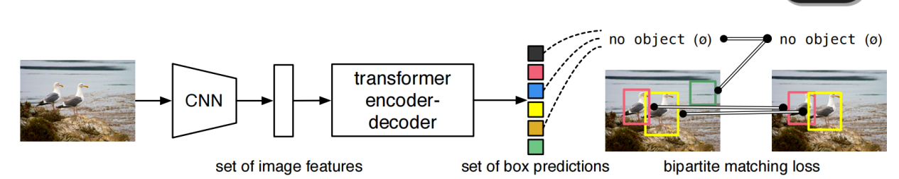
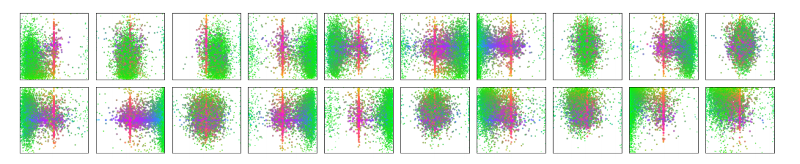
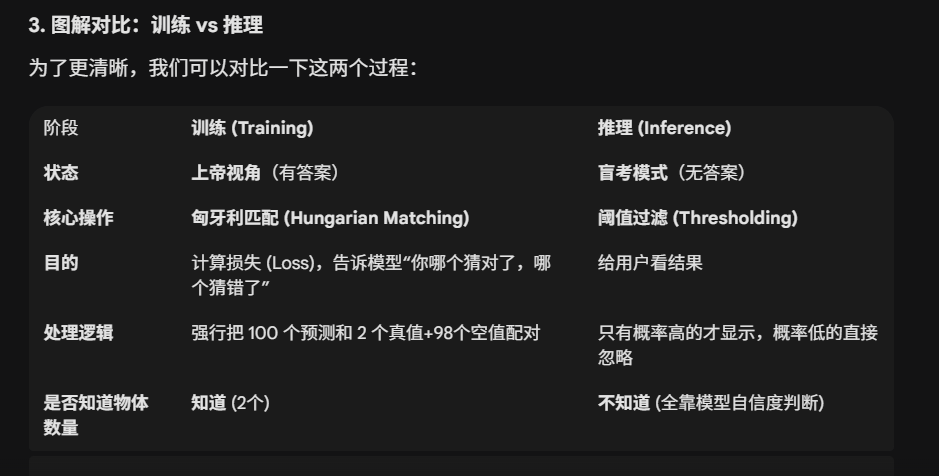

# DETR：用 Transformer 实现端到端目标检测

> 传统目标检测流程过于复杂，需要人工生成大量候选框，再通过 NMS 去除冗余。DETR 证明了存在更简洁、更优雅的方式：一个集合预测损失函数加一个 Transformer 编解码器架构，就能完成端到端检测。

## 训练流程

DETR 的训练流程可以概括为以下步骤：

1. 输入图像，由 Backbone 提取特征
2. 特征送入 Transformer Encoder + Decoder（$N$ 个 Query）
3. 输出 $N$ 个预测框 + 类别
4. 通过 **Hungarian Matching**（匈牙利匹配）找出最优的预测-真实框对应关系
5. 计算损失（分类 + 边框 + GIoU）
6. 反向传播优化

### Step 1：模型前向传播

输入图像经过模型，输出 $N$ 组预测：

$$\hat{y}_i = (\hat{c}_i, \hat{b}_i), \quad i = 1, 2, \ldots, N$$

其中 $\hat{c}_i$ 是预测的类别（含"无物体"类），$\hat{b}_i = [cx, cy, w, h]$ 是归一化坐标的预测框。

### Step 2：匈牙利匹配（Hungarian Matching）

DETR 的核心创新在于——**匹配真实框与预测框**。假设真实标注为：

$$y_j = (c_j, b_j), \quad j = 1, 2, \ldots, M$$

预测有 $N$ 个结果（$N > M$）。算法使用**匹配代价矩阵**：

$$\text{cost}_{i,j} = \alpha \cdot \text{cls\_cost}(\hat{c}_i, c_j) + \beta \cdot \text{L1\_cost}(\hat{b}_i, b_j) + \gamma \cdot \text{GIoU\_cost}$$

使用 **Hungarian Algorithm** 找出最优匹配方式：

$$\sigma^* = \arg\min_{\sigma} \sum_{j=1}^{M} \text{cost}_{\sigma(j), j}$$

每个真实框 $j$ 被分配到唯一的预测框 $\hat{y}_{\sigma(j)}$，其余未分配的预测框自动视为"no object"。这个匹配过程取代了传统检测器中用于将候选框或锚点分配给真实目标的启发式规则。

### Step 3：损失函数

匹配完成后，计算总损失：

$$\mathcal{L}_{\text{total}} = \lambda_{\text{cls}} \mathcal{L}_{\text{cls}} + \lambda_{\text{bbox}} \mathcal{L}_{\text{bbox}} + \lambda_{\text{giou}} \mathcal{L}_{\text{giou}}$$

**分类损失（Cross-Entropy）**：对匹配的预测计算真实类别的交叉熵；对未匹配的预测计算"无物体"类别损失（通常权重较小）。

**边框回归损失（L1）**：直接计算匹配框的 L1 距离 $\mathcal{L}_{\text{bbox}} = \|\hat{b}_i - b_j\|$。

**GIoU 损失**：衡量预测框与真实框的重叠程度 $\mathcal{L}_{\text{giou}} = 1 - \text{GIoU}(\hat{b}_i, b_j)$。

作者在边界框损失部分进行了改进，使用 $l_1$ 损失和尺度不变的 GIoU 损失的线性组合：

$$\mathcal{L}_{\text{box}}(b_i, \hat{b}_{\sigma(i)}) = \lambda_{\text{iou}} \mathcal{L}_{\text{iou}}(b_i, \hat{b}_{\sigma(i)}) + \lambda_{L1} |b_i - \hat{b}_{\sigma(i)}|_1$$

### Step 4：反向传播

整个网络（Backbone + Encoder + Decoder + MLP heads）都是可微的，因此 Loss 通过 Transformer 反向传播，更新所有参数（包括可学习 query 向量）。

### Step 5：重复训练

DETR 的收敛相对较慢（原版要 500 epoch），因为它需要学习每个 query 负责"寻找"不同物体以及 Transformer 的全局匹配模式。后续的改进版（如 Deformable DETR、DN-DETR、DINO、RT-DETR）都在这个阶段做了优化。

## 推理流程

推理阶段不需要匈牙利匹配，流程如下：

1. 图像经过 ResNet Backbone 提取特征
2. 特征送入 Transformer Encoder 进行全局建模
3. Transformer Decoder 用 $N$ 个 query 查找目标
4. MLP 分类头 + 回归头输出 $N$ 组（类别，边框）
5. 丢掉"no object"预测
6. 得到最终检测结果

推理时模型输出 $N$ 个预测，每个都有一个"无物体"概率，直接丢弃预测为"无物体"的结果，余下的就是最终检测框。**不需要 NMS**，因为 DETR 已经在训练阶段通过匹配机制确保每个 query 对应一个目标。

| 阶段 | 训练（Training） | 推理（Inference） |
|---|---|---|
| 状态 | 上帝视角（有答案） | 盲考模式（无答案） |
| 核心操作 | 匈牙利匹配 | 阈值过滤 |
| 目的 | 计算损失，告诉模型哪个猜对了 | 给用户看结果 |
| 处理逻辑 | 强行把 100 个预测和真值+空值配对 | 只有概率高的才显示 |
| 是否知道物体数量 | 知道 | 不知道（全靠模型自信度判断） |

## 模型部分

DETR 的模型架构分为以下几个步骤：

**Step 1：图像特征提取（Backbone）**。输入一张图像（例如 800x800），通过 CNN（通常是 ResNet-50/101）提取特征图，输出形状约为 $(C, H, W)$。例如 $C=2048, H=W=25$，Flatten 成 $HW$ 个 patch。

**Step 2：Flatten + 位置编码**。Transformer 不像 CNN 有空间感知能力，所以 DETR 会为每个位置 $(x, y)$ 加上**位置编码**：

$$\text{Input to Encoder} = \text{feature}(x, y) + \text{pos\_embedding}(x, y)$$

**Step 3：Transformer Encoder**。Encoder 结构类似 BERT，处理输入的所有 patch，通过多头自注意力机制捕捉全局关系，输出编码后的特征序列。这一步相当于让模型"看懂"整张图。

**Step 4：Transformer Decoder（查询机制）**。Decoder 的输入是一组**可学习的 Query 向量**（例如 $N=100$）。每个 query 可以理解为"我要去找一个物体"。Decoder 使用 **cross-attention** 让每个 query 去"关注" encoder 输出的特征，最终每个 query 输出一个向量，代表模型认为的"一个潜在检测结果"。输出是固定数量的 $N$ 个结果（可能有物体，也可能是空）。

**Step 5：预测头**。Decoder 的输出（每个 query）经过两个小的全连接层（MLP）：分类头输出 $\text{softmax}(\text{num\_classes}+1)$ 包含"无物体"类别；回归头输出 $[cx, cy, w, h]$ 归一化坐标形式的检测框。模型会输出 $N$ 组预测结果 $\{(\text{class}_i, \text{bbox}_i) \mid i = 1 \ldots N\}$。

具体的维度变化：输入 $3 \times 800 \times 1066$，经过 CNN 提取特征变成 $2048 \times 25 \times 34$，经过 $1 \times 1$ 卷积将通道数变成 $256 \times 25 \times 34$。拉直变成 $850 \times 256$ 送入 Transformer Encoder，输出 $850 \times 256$。同时 Object Query 进入 Transformer Decoder 进行自注意力（让不同的 Query 交流），然后和编码器输出做交叉注意力，得到 $100 \times 256$。最后接 MLP 输出头，包括类别和边界框，再用匈牙利算法选出最匹配的框，计算损失并反向传播。

Encoder 的主要任务是接收来自 CNN Backbone 的图像特征并进行全局上下文理解；Decoder 的任务则更为具体，需要准确地定位和分类每一个物体，更侧重于细节，学习边缘及干扰问题。

## Object Query

**Object Query** 是一组可学习的向量，代表模型对"可能存在的目标"的一种抽象查询意图。Encoder 输出的是图像的全局特征；Decoder 输入的是 $N$ 个 Object Query；Decoder 输出的结果就是每个 query 认为自己"找到的物体"的特征表示。

### 工作机制

**Step 1：初始化**。初始化 $N$ 个固定的可学习参数向量 $Q = [q_1, q_2, \ldots, q_N], \quad q_i \in \mathbb{R}^d$，例如 $N=100, d=256$。这些是模型参数的一部分，随机初始化，训练时会被更新。

**Step 2：进入 Transformer Decoder**。在 Decoder 的每一层，query 向量会先经过**自注意力**（self-attention），让不同的 query 之间交流，避免重复预测同一个物体；再经过**交叉注意力**（cross-attention），每个 query 作为"查询"，从 Encoder 输出的图像特征（key, value）中"寻找"与它匹配的区域。也就是说，每个 query 主动地去"问"：我对应的物体特征在哪？

**Step 3：输出预测**。Decoder 最后一层输出 $N$ 个向量（每个对应一个 query）：$h_i = \text{Decoder}(q_i)$。然后每个 $h_i$ 送入两个预测头：分类头预测类别（包括"无物体"类），回归头预测边框 $(cx, cy, w, h)$。于是模型输出 100 组预测 $\{(\text{class}_i, \text{bbox}_i)\}_{i=1}^{100}$。

**Step 4：匹配与学习**。训练阶段用匈牙利匹配将这 100 个预测与真实目标一一匹配，未匹配到的 query 被训练成"无物体"类别。这样，模型学会"某些 query 专门去找某一类目标"，"某些 query 负责背景"。

### Object Query 学到了什么？

每个 Query 都学会了自己主要负责的"片区"。例如某个 Query 专门负责图像正中心区域，另一个负责左上角。除了负责的"片区"不同，每个 Query 还发展出了自己的"偏好"——有的擅长寻找大的、横向的物体（如巴士、火车），有的擅长中等大小、接近方形的物体，还有的专注于小尺寸目标。

