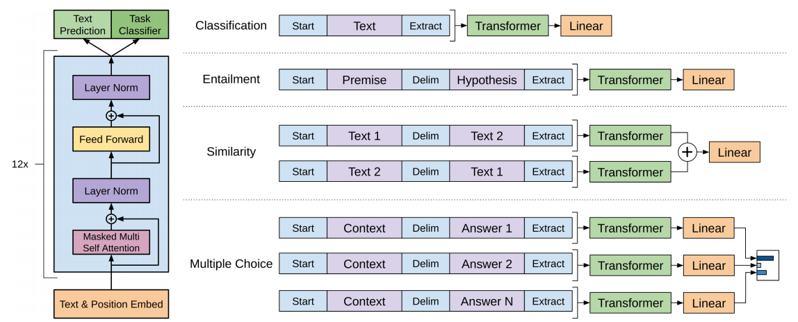

# GPT-1：开创预训练-微调新范式的语言模型

> GPT-1（Generative Pre-trained Transformer 1）由 OpenAI 于 2018 年在论文《Improving Language Understanding by Generative Pre-Training》中提出，开创了"无监督预训练 + 有监督微调"的两阶段学习范式，为后续 GPT 系列乃至整个大语言模型的发展奠定了基础。

## 核心思想：两阶段学习框架

GPT-1 旨在解决当时 NLP 领域许多任务缺乏大量标注数据的问题，提出了**无监督预训练 + 有监督微调**的两阶段方案。

### 阶段一：无监督预训练（Unsupervised Pre-training）

模型在大规模无标注文本语料库（BookCorpus，超过 7000 本未出版书籍）上进行训练，目标是标准的**语言建模（Language Modeling）**——根据前文预测下一个词。

对于一个无标注的词序列 $U = \{u_1, u_2, \dots, u_n\}$，模型最大化以下似然函数：

$$L_1(U) = \sum_i \log P(u_i \mid u_{i-k}, \dots, u_{i-1}; \Theta)$$

其中：

- $k$ 是上下文窗口的大小
- $P$ 是由神经网络模型计算的条件概率
- $\Theta$ 是模型的参数（即 Transformer 解码器的权重）

通过这个过程，模型被迫学习语言规律、语法知识、事实信息以及上下文依赖关系，形成强大的通用语言表示能力。

### 阶段二：有监督微调（Supervised Fine-tuning）

预训练完成后，模型被应用到具体的下游任务（自然语言推断、问答、情感分析、文本分类等）。假设有标签数据集 $C$，每个样本包含输入词序列 $x^1, \dots, x^m$ 和标签 $y$。

微调的目标函数由两部分组成：

**1. 下游任务目标**：模型获取输入序列的最终 Transformer 块激活值 $h_l^m$，送入新增的线性输出层预测标签 $y$，最大化观测到真实标签的概率：

$$L_2(C) = \sum_{(x,y)} \log P(y \mid x^1, \dots, x^m)$$

其中 $P(y \mid x^1, \dots, x^m) = \text{softmax}(W_y h_l^m)$，$W_y$ 是新增线性层的权重。

**2. 语言建模辅助目标**：在微调阶段继续进行语言建模训练，作为正则化手段：

- 提升泛化能力，防止"灾难性遗忘"
- 加速模型收敛

最终的微调目标函数是两者的加权和：

$$L_3(C) = L_2(C) + \lambda \times L_1(C)$$

其中 $\lambda$ 是权重超参数（论文中取 0.5 效果最佳），$L_1(C)$ 是在有标签数据集上计算的语言建模损失。

## 模型架构

GPT-1 基于 **Transformer 解码器（Decoder-only）**，具体为 12 层 Transformer 解码器，共 1.17 亿参数。与完整 Transformer 的编解码器结构不同，GPT-1 仅使用解码器部分，这使其天然适合生成式任务——根据已有文本生成后续内容，与预训练目标（预测下一个词）完美契合。

架构左侧展示了 12 层 Transformer 解码器的内部结构：Text & Position Embed → Masked Multi Self Attention → Layer Norm → Feed Forward → Layer Norm，重复 12 次，顶部接 Text Prediction 和 Task Classifier 两个输出头。

## 下游任务适配

GPT-1 通过巧妙的输入格式设计，将不同类型的 NLP 任务统一到同一个模型框架中。核心思路是使用特殊令牌（`[Start]`、`[Delim]`、`[Extract]`）来组织输入序列。

### 1. 分类（Classification）

- **任务**：给一段文本分配一个类别（如情感分析、垃圾邮件检测）
- **输入格式**：`[Start] [Text] [Extract]`
- **处理方式**：整个序列输入 Transformer，取 `[Extract]` 令牌对应的最终输出向量，送入线性层 → Softmax，输出各类别概率

### 2. 蕴含（Entailment）

- **任务**：判断两句话之间的关系——蕴含、矛盾或无关
- **输入格式**：`[Start] [Premise] [Delim] [Hypothesis] [Extract]`
- **处理方式**：`[Delim]` 分隔符令牌告诉模型这是两个不同的文本部分。自注意力机制捕捉两句话之间的复杂关系，取 `[Extract]` 的输出向量经线性层 → Softmax 输出三个类别的概率

### 3. 相似度（Similarity）

- **任务**：判断两段文本在语义上是否相似
- **输入格式**：为保证 $\text{Similarity}(A, B) = \text{Similarity}(B, A)$，将两段文本以两种顺序分别构建序列：
  - 序列 1：`[Start] [Text 1] [Delim] [Text 2] [Extract]`
  - 序列 2：`[Start] [Text 2] [Delim] [Text 1] [Extract]`
- **处理方式**：两个序列分别通过同一个 Transformer，取各自 `[Extract]` 的输出向量**逐元素相加**，合并后送入线性层输出相似度分数

### 4. 多项选择（Multiple Choice）

- **任务**：给定上下文，从多个选项中选出最合适的答案
- **输入格式**：将上下文与每个选项分别组合为 $N$ 个独立序列：
  - `[Start] [Context] [Delim] [Answer 1] [Extract]`
  - `[Start] [Context] [Delim] [Answer 2] [Extract]`
  - $\dots$
  - `[Start] [Context] [Delim] [Answer N] [Extract]`
- **处理方式**：$N$ 个序列分别通过 Transformer，取各自 `[Extract]` 的输出经线性层得到 $N$ 个分数（logit），最终通过 Softmax 选出最优答案

### 关于 `[Extract]` 令牌

`[Extract]` 作为输入时只是词汇表中的一个特殊令牌。进入模型后，它首先被映射为一个初始嵌入向量，然后随整个序列流经 12 层 Transformer。在每一层中，自注意力机制不断更新该向量，使其融合前面所有令牌的上下文信息。当它从最后一层输出时，已经变成了一个**高度浓缩了整个输入序列信息**的摘要向量，可直接用于分类或预测。

## GPT-1 与 BERT 的对比

| 特性 | BERT | GPT-1 |
|:---|:---|:---|
| **模型结构** | Transformer 编码器（双向） | Transformer 解码器（单向） |
| **预训练任务 1** | 遮盖语言模型（MLM） | 标准语言模型（预测下一个词） |
| **预训练任务 2** | 下一句预测（NSP） | 无 |
| **核心优势** | 真正的双向语境理解能力 | 强大的文本生成能力 |
| **微调分类** | 使用 `[CLS]` 标记的输出 | 使用 `[Extract]` 标记的输出 |

## 主要贡献

1. **验证了生成式预训练的潜力**：在大规模文本语料上进行生成式预训练，可以学到能迁移到多种任务的通用语言表示
2. **开创了"预训练-微调"范式**：这种半监督学习方法成为后续 BERT、RoBERTa 等预训练语言模型遵循的主流技术路线
3. **展示了 Transformer 解码器架构的有效性**：为后续 GPT-2、GPT-3 等更大规模模型铺平了道路，最终引领了当前大语言模型驱动的 AI 浪潮
