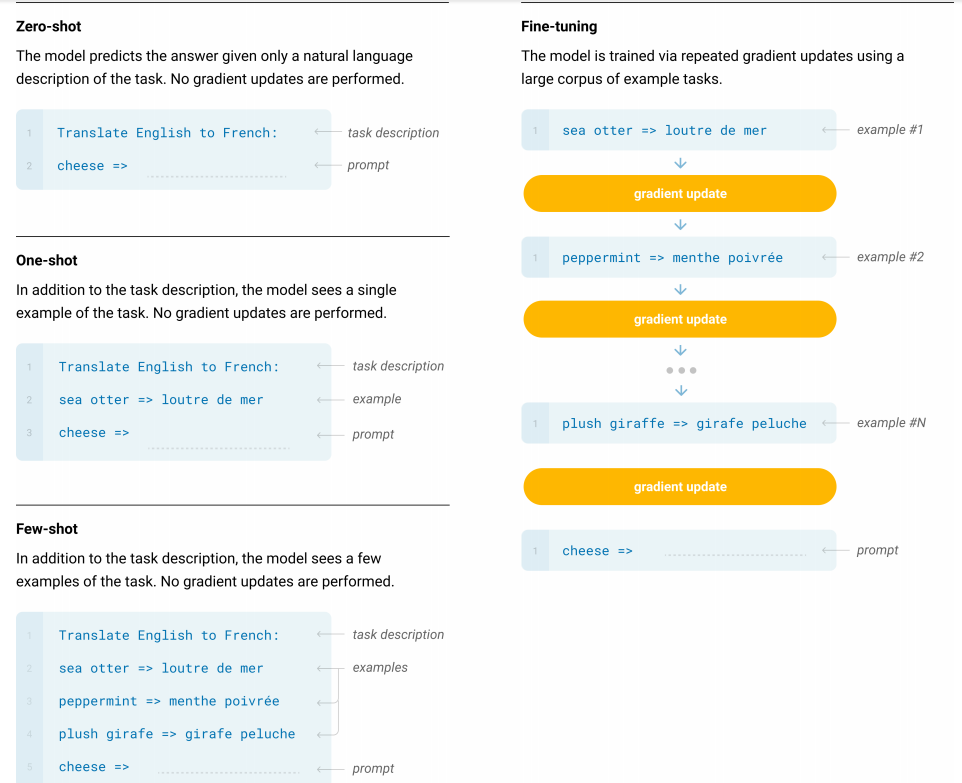

# GPT-3：少样本学习与规模的力量

> GPT-3 通过将模型规模扩展到前所未有的程度，解锁了**情境学习**（In-Context Learning）这一强大能力——仅提供少量样本（Few-Shot），无需任何微调就能出色地完成各种任务。它用实验结果证明：量变真的可以引起质变。

## 核心概念：少样本学习

这是 GPT-3 最核心的贡献。与需要为每个任务进行微调的传统范式不同，GPT-3 证明了模型可以直接从 Prompt 中给出的几个例子来学习并解决问题。文章系统地评估了三种模式：

- **零样本**（Zero-Shot）：只给任务描述，不给例子（类似 GPT-2）。
- **一样本**（One-Shot）：给任务描述，外加一个例子。
- **少样本**（Few-Shot）：给任务描述，外加几个（通常是 10 到 100 个）例子。

关键在于：这个"学习"过程不涉及任何模型参数的更新（没有梯度下降），模型是在"实时"推理中学会任务的，这被称为**情境学习**（In-Context Learning）。



GPT-3 彻底巩固了从"为每个任务训练一个模型"到"用一个通用大模型解决所有任务"的范式转变。它证明了，只要模型足够大，我们与 AI 交互的方式就可以回归到最自然的语言交流——通过指令和示例来引导它完成工作。

## 为什么 Few-Shot 有效却不更新权重

效果变好并不是因为模型学会了新知识，而是因为样本为模型提供了清晰的"任务模板"或"行为指南"，帮助它从自己庞大的知识库中精确地理解并模仿你想要的输出格式和任务逻辑。

其技术层面的核心在于 Transformer 的**自注意力机制**（Self-Attention）。当你的输入包含了样本时，比如：

```
"Translate English to French: sea otter => loutre de mer, cheese => fromage, apple =>"
```

自注意力机制在试图生成 `"apple =>"` 后面的词时，会做以下几件事：

1. **模式识别**（Pattern Recognition）：模型注意到输入序列中存在一种重复的模式——一个英文词，后面跟着 `=>`，再跟着一个法文词。这个模式被识别为当前任务的核心结构。
2. **关联性加权**（Attention Weighting）：当模型处理到最后的 `"apple"` 时，自注意力机制会给予前面例子中的 `"sea otter"` 和 `"cheese"` 很高的关注度（因为它们都是 `=>` 符号前的英文词），同时也会关注 `"loutre de mer"` 和 `"fromage"`（因为它们是答案的格式）。

模型并没有学习到"苹果的法语是 pomme"这个新事实（它早就知道了），而是学会了"你现在想让我执行英法翻译任务，并且按照 `X => Y` 的格式输出"这个**元任务**（Meta-task）。

## 数据集构建

### 数据源选择

GPT-3 的训练数据来自多个来源，旨在覆盖不同类型和风格的文本：

| 数据源 | 描述 |
|:---|:---|
| **Common Crawl**（通用爬取） | 最大的数据来源，包含数万亿网页的巨大档案库，但原始质量参差不齐，包含大量噪音和低质量文本 |
| **WebText2** | GPT-2 所用数据集的扩展版，数据来源于 Reddit 上高赞帖子的外部链接，内容质量相对较高 |
| **Books1 & Books2** | 两个大型的、未公开的互联网书籍语料库，提供高质量、长篇幅、有逻辑结构的文本 |
| **English Wikipedia** | 一个非常高质量、事实密集、结构良好的数据集，涵盖了广泛的主题 |

### 数据清洗与过滤

这是 GPT-3 数据集构建的"秘方"，尤其针对庞大但嘈杂的 Common Crawl 数据。

**筛选高质量内容：训练 AI 当"质检员"**

由于 Common Crawl 质量太差，直接使用效果不好。OpenAI 设计了一个自动化的高质量文本筛选流程：

1. **建立"黄金标准"**：将高质量的 WebText2 和维基百科作为正面样本（代表高质量文本），用一部分原始 Common Crawl 作为负面样本。
2. **训练分类器**：用这些样本训练了一个逻辑回归分类器，任务就是预测一个文档的质量。
3. **进行筛选**：用训练好的分类器去给 Common Crawl 中的每一个文档打分，只保留被预测为"高质量"的文档。

**全局去重（Fuzzy Deduplication）**：在文档级别进行了模糊去重——如果两个文档内容高度相似，就丢弃其中一个。这可以防止模型在训练时过多地看到重复内容，从而提升其泛化能力。

**防止数据污染（Contamination Removal）**：为确保模型在各种标准测试集上的评估是公平的，OpenAI 特意从训练数据中移除了所有与测试集的开发集和测试集有重叠的内容。

### 高效去重：局部敏感哈希（LSH）

为了快速找出相似甚至重复的文章，他们使用了**局部敏感哈希**（Locality-Sensitive Hashing，LSH）技术。该技术能为每篇文章生成一个独特的"指纹"，相似文章的指纹也相似，通过对比指纹就能高效地去重。

LSH 在应用于文章去重时，遵循以下三个核心步骤：

**第 1 步：文本分片（Shingling）——把文章变成集合**

计算机不直接理解文章，所以第一步是把文章转换成可供数学处理的形式——集合。方法是通过一个固定大小的窗口（例如 $k=5$ 个词）滑过整篇文章，将窗口内的词组作为一个元素（称为 Shingle）。

示例：原文 `"a small cat sat on the mat"`，$k=3$ 的 Shingles 为：`{"a small cat", "small cat sat", "cat sat on", "sat on the", "on the mat"}`

比较两篇文章的相似度，就转化为比较两个 Shingle 集合的相似度（通常使用 **Jaccard 相似度**，即 $|交集| / |并集|$）。

**第 2 步：最小哈希（MinHash）——从集合创建紧凑指纹**

直接比较两个巨大的 Shingle 集合依然很慢，需要一种更紧凑的表达方式，即"指纹"或"签名"（Signature）。MinHash 的方法是：

1. 准备 $N$ 个不同的哈希函数（例如 $N=100$）。
2. 对于第一个哈希函数，将它作用于一篇文章的所有 Shingles 上，取其中最小的那个哈希值，作为指纹的第 1 个维度。
3. 对第二个、第三个...第 $N$ 个哈希函数重复此过程。
4. 最终得到一个由 $N$ 个最小哈希值组成的向量（例如一个 100 维的向量），这就是该文章的 MinHash 签名。

MinHash 算法在数学上可以证明，两篇文章 MinHash 签名的相似度（签名中有多少个维度值相同）约等于它们原文 Shingle 集合的 Jaccard 相似度。这样就将比较两个巨大集合的问题，简化为比较两个短小的定长向量。

**第 3 步：分桶技术（Banding）——高效匹配相似指纹**

即使有了紧凑的指纹，如果数据量是十亿级别，两两对比所有指纹依然不可行。分桶技术用来快速锁定"候选者"：

1. 将 100 维的指纹向量切分成 $b$ 个"条带"（Bands），每个条带有 $r$ 行。例如，可以切分成 20 个 bands，每个 band 包含 5 个维度（$b=20, r=5$）。
2. 对每一个 band 单独进行一次哈希，将其哈希到一个"桶"（Bucket）里。
3. **匹配规则**：只要有两篇文章，它们至少有一个 band 的哈希值完全相同（即被放入了同一个桶里），它们就被视为一对"候选相似对"。

如果两篇文章高度相似，它们的 MinHash 指纹也会高度相似，因此它们某个 band 内的 5 个值完全相同的概率就会很高；如果两篇文章不相似，它们某个 band 内的 5 个值恰好完全相同的概率就会非常低。

总结：LSH 是一个多阶段的降维和筛选过程：**Shingling**（文章 -> 词组集合）-> **MinHash**（词组集合 -> 数字指纹）-> **Banding**（数字指纹 -> 候选相似对）。

### 防止模型"作弊"

为确保模型没在训练时见过"考题"（各类评测数据），他们把所有"考题"都打散成微小的文本片段（即 n-grams），并存入一个可供快速搜索的"指纹库"。接着扫描全部训练数据，一旦发现某篇文章包含了这些"考题指纹"，就立即删除，从而保证了后续评测的公正性。
