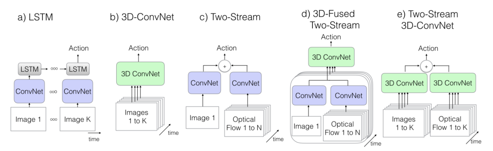
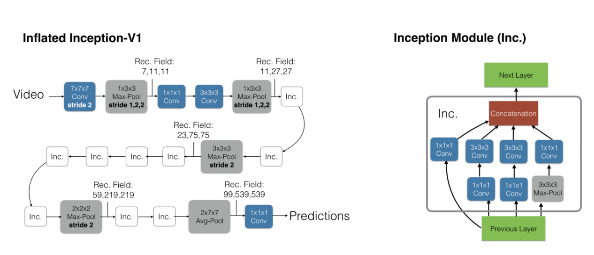

# I3D：从 2D 到 3D，膨胀卷积网络的视频理解之道

> I3D（Inflated 3D ConvNet）通过一种巧妙的"膨胀"操作，将在 ImageNet 上预训练的 2D 卷积网络扩展为 3D 网络，既继承了强大的图像特征提取能力，又能有效学习视频中的时空动态信息。同时，论文发布了大规模视频数据集 Kinetics，成为视频理解领域的 ImageNet。

## 背景与动机

在 I3D 出现之前，视频行为识别领域主要有两种主流方法：

- **3D 卷积神经网络（3D ConvNets）**：直接在视频时空维度上进行 3D 卷积，理论上能最好地学习时空特征，但训练成本高，且容易过拟合
- **双流网络（Two-Stream Networks）**：使用两个独立的 2D 卷积网络，一个处理静态 RGB 图像帧（空间流），另一个处理光流（时间/运动流），最后融合结果。效果好但结构复杂，且未能端到端地同时学习时空特征

作者的核心问题是：能否将强大的 2D 图像识别模型（如 Inception-V1）的优势平滑地迁移到 3D 视频模型中，从而既利用 ImageNet 预训练的能力，又有效学习视频中的时空动态信息？

## 术语说明

- **Benchmark**（基准测试）：用于比较和衡量的标准或参考点
- **Fusion**（融合）：在技术领域特指数据融合或特征/模型融合
- **Inflate**（膨胀）：将 2D 卷积核扩展成 3D 卷积核的技术

## 五种视频识别架构对比



### a) LSTM

将视频识别分为两步——先提取空间特征，再处理时间序列。每一帧图像先经过 2D ConvNet（通常在 ImageNet 上预训练）提取静态特征，然后将特征向量按时间顺序输入 LSTM，学习特征随时间变化的模式。

### b) 3D-ConvNet

将视频看作三维"立方体"（宽 $\times$ 高 $\times$ 时间），使用 3D 卷积核（例如 $3 \times 3 \times 3$）直接在上面卷积，不仅学习空间特征，还同时捕捉相邻帧之间的运动信息。是端到端的时空特征学习器。

### c) Two-Stream（双流网络）

设计两个独立分支：

- **空间流**：输入单帧或几帧 RGB 图像，学习场景和物体的外观信息
- **时间流**：输入多帧图像计算出的**光流**（Optical Flow），学习视频的运动模式

最后将两个分支的预测结果融合（如取平均或加权求和）。

### d) 3D-Fused Two-Stream

对双流网络的改进——在网络中间层，两个流的特征图进行融合，融合后的特征被送入 3D ConvNet 做后续时空特征学习。一般先 2D 再 3D 的效果较好。

### e) Two-Stream 3D-ConvNet（I3D）

I3D 的经典架构，本质上是双流架构，但每个流内部都换成了 3D ConvNet：

- **RGB 流**：一个完整的 3D ConvNet，输入一段视频的 RGB 帧
- **光流流**：另一个独立的 3D ConvNet，输入对应视频帧的光流场

最后像传统双流网络一样融合两个 3D ConvNet 的预测结果。

## 核心技术：将 2D 网络膨胀为 3D 网络

I3D 的精髓在于 **Inflation（膨胀）** 技术，这是一种自举（Bootstrapping）方法，能将预训练好的 2D 模型（如 Inception-V1）的权重直接迁移到 3D 网络中。

### 膨胀卷积核

标准 2D 卷积核维度为 $H \times W$（例如 $3 \times 3$）。为处理视频，将其扩展为 $T \times H \times W$（例如 $3 \times 3 \times 3$）。

具体做法：将 2D 卷积核的权重在时间维度上复制 $N$ 次，然后除以 $N$ 进行归一化，确保输出的激活值大小与原网络一致。

### 膨胀池化层

同理，$H \times W$ 的 2D 池化窗口（例如 $2 \times 2$）扩展为 $T \times H \times W$ 的 3D 池化窗口（例如 $2 \times 2 \times 2$），使网络不仅在空间上，也在时间上对视频数据进行降采样。

### Bootstrapping 的直觉

核心思路：如果预训练好的模型搬过来用，同样的输入应该得到同样的输出。将一张 2D 图片逐帧重复组合成一个"静态视频"，那么 3D 网络的输出应当与原始 2D 网络一致。因此把卷积核参数堆叠 $N$ 次，再除以 $N$ 做缩放即可：

```python
inflated_2d = nd.broadcast_to(temporal_2d, shape=[0, 0, temporal_dim, 0, 0]) / temporal_dim
```

### 架构细节



值得注意的是，MaxPooling 并未直接使用 $3 \times 3 \times 3$，而是使用 $1 \times 3 \times 3$——**时间维度上最好不要直接使用这种下采样**，以保留更多的时序信息。

## 两大贡献

### I3D 模型

I3D 将一个在 ImageNet 上预训练好的顶级 2D 图像分类网络（Inception-V1）"膨胀"成 3D 网络。3D 网络可以直接继承 2D 模型强大的图像特征提取能力，无需从零开始训练，只需专注于学习时间（运动）模式，极大降低了训练难度和数据需求。

结合经典"双流"思想，构建两个 I3D 网络：

- **RGB 流**：输入原始视频帧，专注于学习场景、物体的外观信息
- **光流流**：输入预先计算好的光流场，专注于学习运动信息

### Kinetics 数据集

论文的另一大贡献是发布了大规模、高质量的视频动作识别数据集 **Kinetics**。最初的 Kinetics-400 版本包含 400 个动作类别，约 30 万个来自 YouTube 的、经过人工筛选的 10 秒视频片段，远超当时所有同类数据集。

Kinetics 数据集采用自举（Bootstrap）策略构建——"模型预测、人工验证"的迭代循环，高效地从海量视频中筛选并标注数据。Kinetics 很快成为视频理解领域的"ImageNet"，**在 Kinetics 上预训练，然后在目标任务上微调**成为后续几乎所有视频研究的黄金标准和基本操作。
