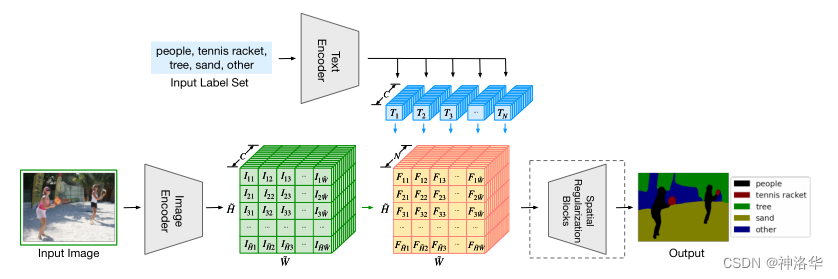
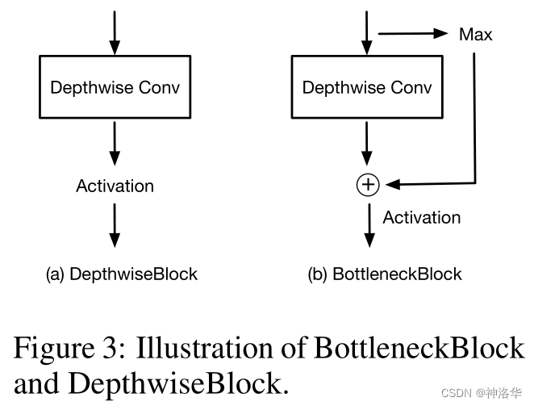

# LSeg：语言驱动的语义分割

> LSeg 的核心思路是将 CLIP 的图文对齐思想从图像级别扩展到像素级别，在传统有监督分割 pipeline 中加入文本分支，使模型在推理时能够根据任意文本 prompt 进行 zero-shot 语义分割。

## 动机与核心思想

语义分割本质上是像素级分类任务。LSeg 借鉴了 CLIP 的图文对齐思想，通过类别 prompt 作为文本输入，计算像素与文本之间的相似度来实现开放词汇分割。

LSeg 的关键在于把文本分支真正接入传统有监督分割 pipeline，使图像特征在训练阶段就朝着语言语义空间对齐。

## 模型架构

文本编码器输出类别文本特征，图像编码器输出逐像素密集特征，二者通过相似度计算得到每个空间位置对各个类别 prompt 的响应，再经过 Spatial Regularization Blocks 做细化。

### 各模块详解

- Text Encoder：使用冻结的 CLIP 文本编码器。
- Image Encoder：采用 DPT 风格的密集视觉特征提取结构。
- Spatial Regularization Blocks：在相似度图之后进行空间细化与局部传播。

## 训练与推理

LSeg 在训练阶段使用像素级分割标签和交叉熵损失进行监督学习；在推理阶段则允许输入任意文本 prompt，直接输出对应的语义分割结果。
