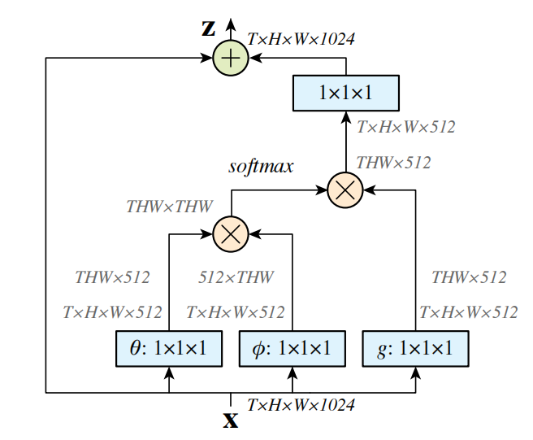

# Non-Local：用非局部操作捕获长距离时空依赖

> **Non-Local Neural Networks** 受经典的非局部均值（Non-local Means）算法启发，提出了一种能捕获长距离依赖的 Non-Local 算子。该算子是即插即用的模块，可建模图像中远距离像素的联系、视频中不同帧的联系、以及文本中不同词的联系。

## 研究动机

卷积（convolutional）和递归（recurrent）操作都作用于**局部区域**，属于典型的 local operations。如果能看到更长距离的上下文，显然对各种任务都有帮助。

**Non-Local Block** 将自注意力机制从一维的文本序列推广到了三维的视频数据上。它让网络中的**每个时空位置**都能直接关注到整个视频片段中**任意时间、任意空间位置**的特征（因此称为**时空自注意力**），从而一步到位地捕获全局的、长距离的时空依赖关系，打破了传统卷积只能处理局部邻域的限制。

Non-Local 算子在计算某个位置的响应时，考虑**所有位置特征的加权和**——这里的"所有位置"可以是空间的、时间的、或时空的。由于它是一个即插即用的 building block，泛化性好，在视频分类、物体检测、实例分割、姿态估计等任务上都取得了不错的效果。

## Non-Local Block 结构

上图中 $T$ 是输入的视频帧数量，$H$ 和 $W$ 是视频帧的高宽尺寸。计算过程中，$\theta$、$\phi$、$g$ 的通道维度是输入 $\mathbf{x}$ 的一半，用于减少计算量。最后乘以 $W_z$（即图中 $1 \times 1 \times 1$ 的卷积操作）恢复原来的通道数。

整个模块采用**残差连接**的设计（$\otimes$ 和 $\oplus$ 分别表示矩阵乘法和矩阵加法），输出为：

$$\mathbf{z} = W_z \cdot \text{softmax}(\theta(\mathbf{x})^\top \phi(\mathbf{x})) \cdot g(\mathbf{x}) + \mathbf{x}$$

这种残差结构使得我们可以在任意模型中插入一个新的 Non-Local Block，而不改变其原有的网络结构。
