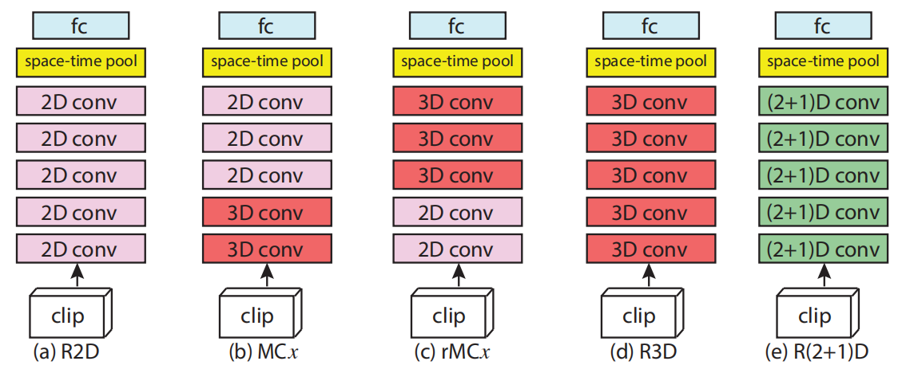
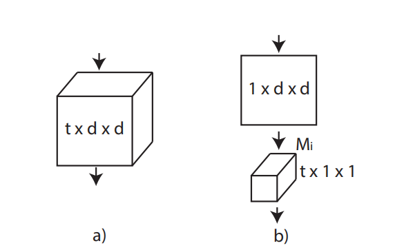
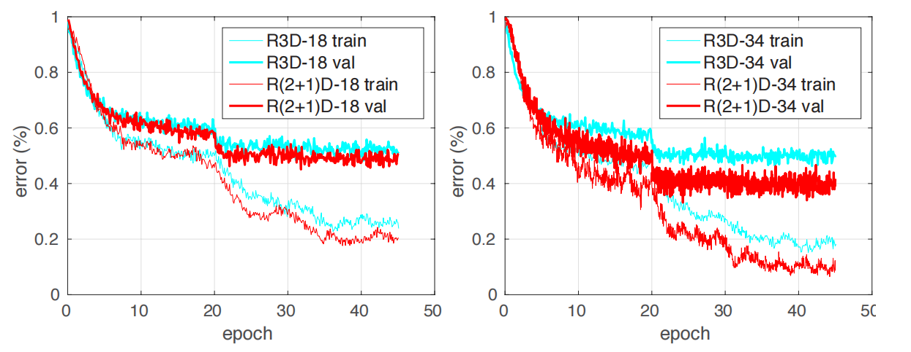

# R(2+1)D：将 3D 卷积拆分为空间 2D + 时间 1D

> 这是一篇实验性质的论文，系统性地探讨了动作识别任务中时空卷积的多种网络结构。核心结论：将 3D 卷积拆分为空间上的 2D 卷积加时间上的 1D 卷积，效果最好且易于训练。

## 研究动机

作者发现，仅使用 2D CNN 逐帧抽取特征后进行动作识别，效果与 3D 网络相差不大，而 2D CNN 的计算成本远低于 3D CNN。因此作者考虑在 3D CNN 中部分引入 2D CNN，并系统性地试验了多种结构。

## 五种网络结构

- **R2D**：将时间维度合并到通道维度，即 $[C, T, H, W] \to [CT, H, W]$，然后直接输入 2D 卷积网络。
- **MCx**：前 x 层为 3D 卷积，上层为 2D 卷积——先在底层抽取时空特征，再用 2D CNN 降低复杂度。
- **rMCx**：先用 x 层 2D 卷积逐帧抽取特征，再用 3D 卷积做融合。
- **R3D**：ResNet 版本的 I3D，backbone 使用 3D ResNet。
- **R(2+1)D**：本文提出的结构，先做 2D 空间卷积，再做 1D 时间卷积，效果最优。

## R(2+1)D 的分解方式

R(2+1)D 将一个 $t \times d \times d$ 的 3D 卷积核拆分为两步：

1. **2D 空间卷积层**：使用 $M_i$ 个尺寸为 $1 \times d \times d$ 的卷积核，只在空间维度上卷积，时间维度保持不变。
2. **ReLU 非线性激活函数**。
3. **1D 时间卷积层**：使用 $N_i$ 个尺寸为 $t \times 1 \times 1$ 的卷积核，只在时间维度上卷积，空间维度保持不变。

中间层的通道数 $M_i$ 经过精心设计，使分解后的 (2+1)D 模块与原始 3D 卷积层拥有几乎相同的参数量。计算公式为：

$$M_i = \left\lfloor \frac{t d^2 N_{i-1} N_i}{d^2 N_{i-1} + t N_i} \right\rfloor$$

## 两大关键优势

**增强非线性表达能力**：相比原始 3D 卷积，拆分后多了一次卷积操作和一次 ReLU 激活，模型的学习能力更强。

**简化优化过程**：直接使用 3D 卷积时模型较难学习。拆分为两步之后，降低了模型学习的难度。在参数量相同的情况下，R(2+1)D 的训练损失和测试损失都更低，且网络越深差距越明显。

上图清楚地表明，R(2+1)D 的训练误差和测试误差都更小，既不是过拟合也不是欠拟合，而是网络确实更容易训练。

## 总结

这篇论文是一次优雅的"解构主义"实践。它没有提出颠覆性的新模块，而是通过对 3D 卷积的精巧拆分，释放了其潜藏的能量。

- **思想简洁有效**：空间 + 时间的分解带来了"增加非线性"和"简化优化"两大关键收益。
- **实验严谨扎实**：通过控制变量，在 Sports-1M、Kinetics 等数据集上系统性对比了多种时空卷积形式，令 R(2+1)D 的优越性令人信服。
- **实践指导性强**：为后续的视频模型设计（如 SlowFast、X3D）提供了重要的基础模块和设计思想。
