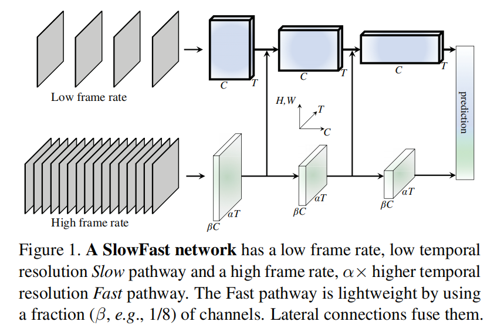

# SlowFast：快慢双路径网络的视频理解

> **SlowFast Networks** 受人类视觉系统的启发，设计了快慢结合的双路径网络。Slow 路径以低帧率捕获空间语义信息，Fast 路径以高帧率捕获运动信息。两条路径通过横向连接进行信息交流，在 Kinetics 视频分类（79.0%）和 AVA 动作检测（28.3 mAP）上均达到了当时的 SOTA。

## 研究动机

人的视觉系统有两种细胞：**P 细胞**和 **M 细胞**。P 细胞数量占比约 80%，主要处理静态图像；M 细胞占比约 20%，主要处理运动信息。这种分工方式类似双流网络，受此启发，作者设计了 SlowFast 网络。

## 整体架构

SlowFast 由两条路径组成：

- **Slow 路径**（上方）：低帧率，少输入，深网络——对应 P 细胞，负责捕获空间语义信息。
- **Fast 路径**（下方）：高帧率，多输入，浅网络——对应 M 细胞，负责捕获运动信息。

两条路径之间通过**横向连接（Lateral Connection）**进行信息交流。

## Slow 路径

Slow 路径是网络的主干，设计目标是**识别空间语义**，核心特点是**低帧率**：

- 它从原始视频中以较大的时间步长 $\tau$ 进行稀疏采样。例如对于 30 fps 的视频，若 $\tau = 16$，则大约每秒只采样 2 帧。
- 假设 Slow 路径总共处理 $T$ 帧，那么它覆盖的原始视频时长为 $T \times \tau$。
- 它可以是任何主流的 3D CNN 架构，如 3D ResNet 或 R(2+1)D。

## Fast 路径

Fast 路径是 SlowFast 的精髓所在，设计目标是**捕捉精细的运动信息**：

- **高帧率**：Fast 路径的采样步长为 $\tau / \alpha$，其中 $\alpha > 1$ 是快慢路径之间的速度比。若 $\alpha = 8$，则 Fast 路径的采样密度是 Slow 路径的 8 倍，总共会采样 $\alpha T$ 帧。
- **高时域分辨率特征**：Fast 路径在网络的大部分层中都**不进行时间维度的下采样**（没有时间池化或步长大于 1 的时间卷积），从而在特征层面也保持了高时域分辨率。
- **低通道容量**：这是实现轻量化的关键。Fast 路径的通道数仅为 Slow 路径的 $\beta$ 倍，其中 $\beta < 1$（例如 $\beta = 1/8$）。由于卷积层的计算量通常与通道数的平方成正比，这使得 Fast 路径的计算成本极低（约占总计算量的 20%），也意味着它处理空间信息的能力较弱，从而更专注于时间维度。

## 横向连接（Lateral Connection）

为了让两条路径交流信息，作者在网络的不同阶段加入了从 **Fast 路径到 Slow 路径的单向横向连接**。

由于两条路径的特征图在时间维度（$T$ vs $\alpha T$）和通道维度（$C$ vs $\beta C$）上都不同，连接时需要进行变换来匹配尺寸。论文实验了多种连接方式：时间到通道的变换（Time-to-Channel）、时间步长采样（Time-strided Sampling）和**时间步长卷积（Time-strided Convolution）**，发现时间步长卷积效果最好。

横向连接的工作流程如下：

1. **初始状态**：Slow 路径产出 `Feature_Slow_Old`，Fast 路径产出 `Feature_Fast`。
2. **信息分流**：`Feature_Fast` 兵分两路——一路进入横向连接被变换为 `Feature_Fast_Transformed`，准备去支援 Slow 路径；另一路保持原样继续在 Fast 路径上前进。
3. **融合**：Slow 路径接收支援，`Feature_Slow_New = Feature_Slow_Old + Feature_Fast_Transformed`。
4. **各自前进**：Slow 路径使用融合后的特征继续计算；Fast 路径使用自己原始的、未被融合影响的 `Feature_Fast` 继续计算。

### 为什么这样设计？

这体现了 SlowFast 架构**分工明确**的思想：

- **Fast 路径**自始至终保持纯粹，唯一任务就是以高帧率捕捉最原始、最精细的动态变化。如果被 Slow 路径的低频语义信息"污染"，它就失去了作为"侦察兵"的专业性。
- **Slow 路径**作为主干，任务是理解高级语义。它不需要自己去费力捕捉高频动态，而是周期性地从 Fast 路径获取"动态情报"，并融入到自己的语义理解中。

## 最终融合

当两条路径都完成各自的所有计算后，在最后的分类层之前，需要一次最终融合：

1. 两条路径的输出特征图各自经过一个**全局平均池化（Global Average Pooling）**，变成两个一维特征向量。
2. 两个特征向量被**拼接（Concatenate）**在一起，形成一个更长的特征向量。
3. 拼接后的向量被送入全连接分类层，得到最终的预测结果。
