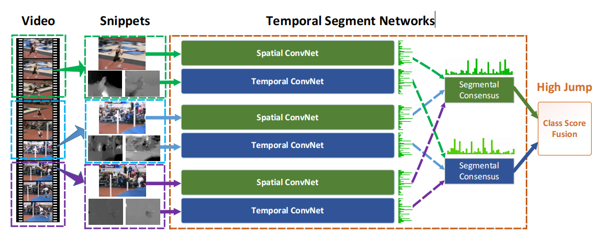
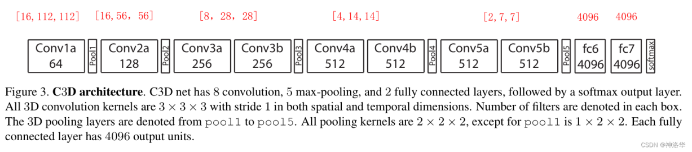

# TSN：用分段共识处理长视频的双流网络

> **Temporal Segment Networks (TSN)** 提出了一种简单而高效的长视频处理框架：将视频均匀分成 K 段，在每段中随机采样后分别输入共享参数的双流网络，最后通过 Segmental Consensus 融合得到最终预测。本文还贡献了一系列被后续工作广泛采用的训练技巧。

## 核心思想

之前的**双流网络**输入仅为单帧 RGB 图像和约 10 帧光流图像（大概只覆盖半秒），只能处理很短的视频段。TSN 的想法非常直接——把长视频分成 K 段来处理：

具体流程如下：

1. 将长视频均匀分成 K 段，在每段中**随机抽取一帧**作为 RGB 输入，并取后续连续 10 帧计算**光流图像**作为光流输入。
2. 分别通过 K 个**共享参数**的双流网络，得到 2K 组 logits（每组包含空间流和时间流两个输出）。
3. 将 K 个空间流输出做一次融合（**Segmental Consensus**，即达成共识），时间流输出同理。融合方式可以是取平均或 LSTM 等。最后将两路融合特征做一次 **late fusion**（加权平均）得到最终结果。

## 训练技巧及效果

### Cross Modality Pre-training

作者提出了使用 ImageNet 预训练模型为光流网络做初始化的技巧。此前并没有好的光流预训练模型，光流网络只能从头训练，而视频数据集通常较小，效果不理想。问题在于 ImageNet 预训练模型的输入通道数为 3（RGB），光流网络输入通道数为 20，无法直接使用。

作者的解决方案：将预训练模型第一层 RGB 三个通道的权重取平均，得到单通道权重，然后复制 20 次。这种初始化技巧使模型精度提升了约 5 个百分点，后来被广泛采用——I3D 中用 2D 预训练模型初始化 3D 模型也是类似的思路。

### 正则化技术

- **部分 BN（Partial BN）**：使用预训练模型初始化后，冻结除第一层外所有 Batch Normalization 层的均值和方差参数。光流和 RGB 图像的分布差异主要影响第一层激活值，因此只需微调第一层 BN 即可。
- **额外 Dropout**：在 BN-Inception 的全局池化层之后增加一个 Dropout 层，空间流的 dropout 率为 0.8，时间流为 0.7。

### 数据增强（Data Augmentation）

在传统双流网络的随机裁剪和水平翻转基础上，作者新增了两种方法：

- **角裁剪（Corner Cropping）**：传统 random crop 倾向于裁剪图片中间部分，很难覆盖边角区域。作者强制仅从图片的四个角或中心进行裁剪。
- **尺度抖动（Scale Jittering）**：先将视频帧 resize 到 $[256, 340]$，然后从列表 $\{256, 224, 192, 168\}$ 中随机选取长和宽进行裁剪（例如 $168 \times 256$、$224 \times 224$ 等），丰富图片尺寸，减少过拟合。

### 消融实验

下表展示了在 UCF101 数据集上各训练技巧的效果：

| 训练策略 | Spatial ConvNets | Temporal ConvNets | Two-Stream |
|:---|:---:|:---:|:---:|
| Baseline | 72.7% | 81.0% | 87.0% |
| From Scratch | 48.7% | 81.7% | 82.9% |
| Pre-train Spatial | 84.1% | 81.7% | 90.0% |
| + Cross modality pre-training | 84.1% | 86.6% | 91.5% |
| + Partial BN with dropout | 84.5% | 87.2% | 92.0% |

从零开始训练比 baseline 差很多，说明必须重新设计训练策略来降低过拟合风险，尤其是空间网络。对时空网络都进行预训练，再加上 Partial BN，效果最佳。

## 处理更长的原始视频

这种将视频分 K 段再做 Segmental Consensus 的方法，除了裁剪好的视频片段（video clip）外，还可以应用于**完全未裁剪的长视频**。如果长视频包含多种事件和动作，分成的 K 段可能包含不同的事件，此时将融合方式从平均/max 改为 **LSTM** 即可。2017 年的 UntrimmedNet 就是用这种思路处理未裁剪的长视频进行分类的。

## Segmental Consensus 用于对比学习

本文用 Segmental Consensus 做有监督训练，UntrimmedNet 做弱监督训练，但这一思想同样适用于**对比学习**。

之前的工作通常将视频中任意两帧视为正样本，其他视频帧为负样本。但如果视频较长，任意抽取的两帧不一定构成合理的正样本对。借鉴 Segmental Consensus 的思想，可以将长视频分为 K 段后，从每段各抽取一帧组成第一个样本；再从每段各抽取另一帧组成第二个样本。由于两个样本都覆盖了从 Segment 1 到 Segment K 的完整时序走势，互为正样本更加合理。

## 3D CNN 前言

上一章讲了双流网络及其改进。双流网络的方式非常合理且效果好，但研究者们一直想用 3D CNN 替代它，核心原因在于**光流抽取**的问题。

### 光流抽取的瓶颈

**耗时严重**：常用的 TVL1 光流算法（GPU 实现）计算一帧需约 0.06 秒。以 UCF-101 数据集为例，约 1 万视频、每个 10 秒、30 fps，共约 300 万帧，抽取光流约需 50 小时。对于 Sports-1M 这样更大的数据集（100 万视频，时长数分钟），即使 8 卡 GPU 也需要一个多月。每尝试一个新数据集，都要先花费大量时间抽取光流。

**存储空间大**：即使将光流存储为 JPEG 图像，UCF-101 的光流仍需 27 GB，Kinetics-400 约需 500 GB。如此大的数据量在训练时会严重拖慢 IO 读取速度。

**无法实时推理**：TVL1 算法约 15 fps，低于实时要求的 25 fps，而这还只是抽取光流的时间，尚未包含模型推理。

综合以上因素，越来越多的研究转向 **3D CNN**——直接从视频中学习时空特征，不再需要额外的时间流网络和光流。不过回过头来看，3D CNN 和 Video Transformer 越做越大，大部分视频模型依旧不是实时的；在 3D CNN 或 Video Transformer 中加入光流仍可进一步提升性能，光流依旧是一个很好的特征。

## C3D：3D 卷积神经网络

C3D 的核心思想很简单：将所有 **2D 卷积核**（$3 \times 3$）替换为 **3D 卷积核**（$3 \times 3 \times 3$），2D 池化层（$2 \times 2$）替换为 3D 池化层（除第一个为 $1 \times 2 \times 2$ 外，其余均为 $2 \times 2 \times 2$）。

网络包含 8 个卷积层、5 个池化层、2 个全连接层和最终的 softmax 分类层。整体构造相当于将 VGG-16 每个 block 减去一个卷积层，再将 2D 操作改为 3D，因此 C3D 本质上是一个 **3D 版的 VGG**（共 11 层）。

模型输入维度为 $[16, 112, 112]$（16 帧视频帧，每帧 $112 \times 112$）。由于 padding 的存在，卷积只改变通道数不改变尺寸，池化负责降低空间和时间维度。

作者发现直接预训练后微调效果不佳，最终采用的方法是**抽取 FC6 层的输出特征**，再**训练一个 SVM 分类器**得到最终输出。因此 C3D 更多时候指代的是 FC6 层抽取出的特征。

这与当前 Transformer 的使用方式类似——很多多模态任务中，即使用 Transformer 微调也难以训练，因此通常先抽取 Transformer 特征，再做多模态融合。做研究除了考虑新颖度，还需要考虑易用性和适用性。
