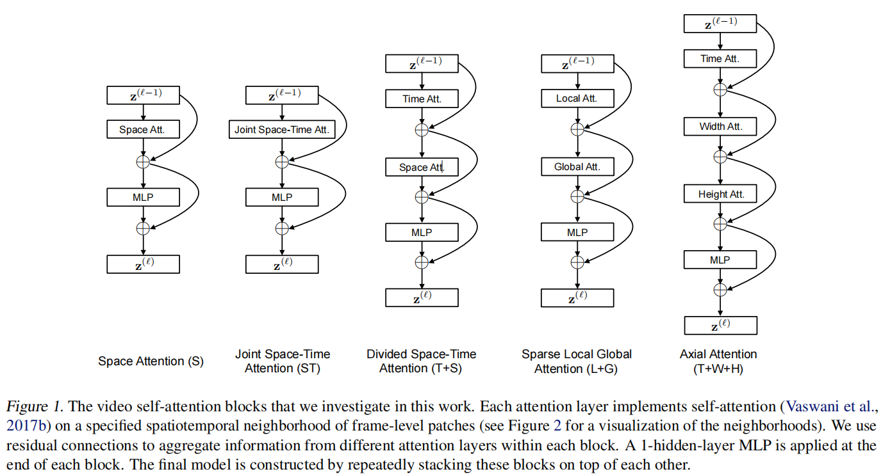
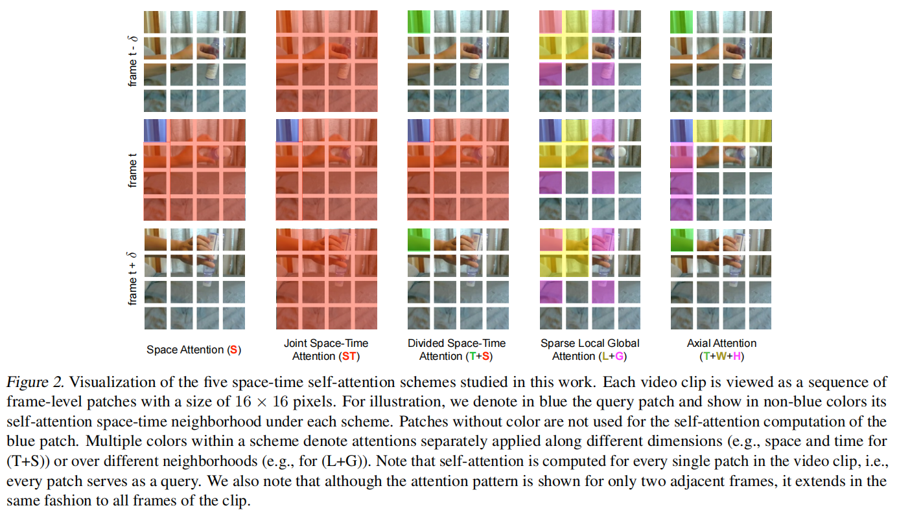

# TimeSformer：将 ViT 从图像扩展到视频的时空自注意力

> Video Transformer 将视觉 Transformer 从图像领域迁移到视频领域，是视频理解进入全局时空建模阶段的重要标志。TimeSformer 则是这一阶段最具代表性的早期工作之一：它没有简单把 ViT 直接套到视频上，而是系统比较了五种时空自注意力方案，最终提出了效果最优的拆分时空注意力（Divided Space-Time Attention）。

## 研究动机

在 TimeSformer 之前，视频理解已经经历了几轮重要演化：

1. **DeepVideo**：最早尝试把 CNN 用到大规模视频数据上，但对运动信息利用不足。
2. **Two-Stream / TSN**：显式把外观和运动拆开建模，推动视频理解进入深度学习主流阶段。
3. **I3D / R(2+1)D / SlowFast**：3D CNN 成为主角，时空建模能力持续增强。
4. **Video Transformer**：开始尝试把图像 Transformer 的全局建模能力迁移到视频任务。

TimeSformer 所面对的核心问题是：**如何把 ViT 的自注意力从 2D 图像扩展到 3D 视频**。

这件事看似自然，实际上有两个难点：

- **视频 token 数量暴涨**：图像只有空间维，视频还多了时间维，若直接做联合时空注意力，计算量和显存开销都会迅速膨胀。
- **已有 3D CNN 已经很强**：若 Transformer 不能在精度、效率或可扩展性上给出明确优势，就很难成为更优解。

因此，论文不是简单回答“能不能把 Transformer 用到视频”，而是进一步追问：**视频里的时空注意力到底应该怎样组织，才既算得动，又学得好**。

## 五种时空自注意力方案

论文系统比较了五种把自注意力从图像扩展到视频的方法：

| 方案 | 缩写 | 核心做法 | 直觉特点 |
|---|---|---|---|
| Space Attention | S | 每帧内部独立做空间注意力 | 只能看单帧，无法建模跨帧关系 |
| Joint Space-Time Attention | ST | 所有时空 token 一次性全连接 | 表达力最强，但代价最高 |
| Divided Space-Time Attention | T+S | 先做时间注意力，再做空间注意力 | 在效率与表达力之间最均衡 |
| Sparse Local Global Attention | L+G | 先局部再全局稀疏建模 | 试图近似全局时空关系 |
| Axial Attention | T+W+H | 沿时间、宽度、高度分别建模 | 彻底分解注意力维度 |

## 拆分时空注意力为什么关键

TimeSformer 最终选择的是 **Divided Space-Time Attention**。它的核心顺序非常清晰：

1. 固定空间位置，只在时间维做注意力。
2. 固定时间帧，只在空间维做注意力。
3. 最后再经过 MLP 聚合表示。

写成 block 的形式，就是：

$$
x' = x + \mathrm{TemporalAttn}(\mathrm{LN}(x))
$$

$$
x'' = x' + \mathrm{SpatialAttn}(\mathrm{LN}(x'))
$$

$$
x_{out} = x'' + \mathrm{MLP}(\mathrm{LN}(x''))
$$

这个设计的重要性在于，它并没有放弃全局建模，而是把一次昂贵的联合时空注意力拆成两步更可控的子问题：

- **Temporal Attention** 负责学习同一空间位置在不同帧中的变化规律。
- **Spatial Attention** 负责学习同一帧内部不同 patch 之间的空间关系。

这种顺序和 R(2+1)D 把 3D 卷积拆成空间卷积与时间卷积的思路有相似之处：都是把一个难学、难算的 3D 关系分解成两个结构更清晰的步骤。

## 注意力范围可视化

下图展示了五种方案对同一个蓝色 query patch 的感受范围：

从图里可以直观看出：

- **S** 只关注当前帧。
- **ST** 同时看所有帧和所有 patch，最全面，也最昂贵。
- **T+S** 先沿时间轴聚合同位置 patch，再在单帧内建模空间关系。
- **L+G** 用局部 + 全局稀疏注意力近似完整时空交互。
- **T+W+H** 把 3D 注意力分解成三个 1D 方向上的注意力。

这张图其实就是整篇论文的核心：**视频 Transformer 真正难的，不是能不能引入时间维，而是时间维和空间维应该以什么代价、什么顺序发生交互**。

## TimeSformer 在视频理解脉络中的位置

论文还把视频理解的发展分成四个阶段：

### 阶段一：DeepVideo

最早把 CNN 用于视频理解，并提出 Sports-1M 这样的大规模数据集，但运动建模仍比较薄弱。

### 阶段二：Two-Stream 系列

引入光流，明确把外观与运动拆成两条分支处理，显著提升动作识别性能。

### 阶段三：3D CNN 系列

I3D、R(2+1)D、Non-Local、SlowFast 等方法持续增强时空建模能力，把视频卷积网络推进到成熟阶段。

### 阶段四：Video Transformer

当 3D CNN 在结构上逐渐逼近上限后，Transformer 开始接管更长程、更全局的时空关系建模。TimeSformer 正是这一阶段的重要起点。

## 实验结论

TimeSformer 的实验结论很有代表性：

- 在多个视频理解数据集上达到当时的强结果。
- 相比 3D CNN，训练速度更快，推理代价更低。
- 更容易扩展到更长的视频片段与更大的模型规模。

它真正证明的不是“Transformer 一定全面替代 3D CNN”，而是：**在视频任务里，合理设计时空注意力的结构后，Transformer 可以用更统一的全局关系建模方式，进入过去卷积模型主导的领域**。

## 总结

TimeSformer 的核心贡献可以压缩为三点：

- **它把 ViT 从图像稳健地扩展到了视频**。
- **它系统比较了五种时空注意力方案，而不是只给出单一结构**。
- **它证明拆分时空注意力是视频 Transformer 的一条高性价比路线**。

如果从方法论上看，TimeSformer 最重要的启发不是“把注意力做得更大”，而是：**先把时空交互拆成结构清晰、计算可控的步骤，再去追求全局建模能力**。这也是它后来影响 ViViT、MViT、Video Swin 以及更多视频 Transformer 路线的重要原因。
