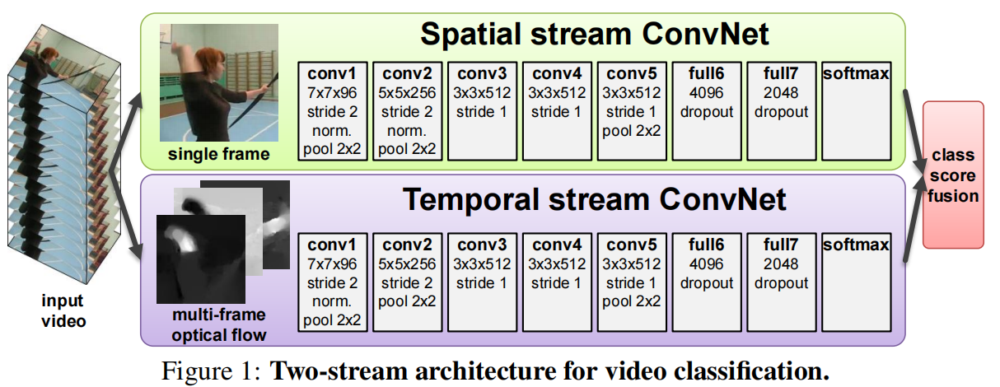
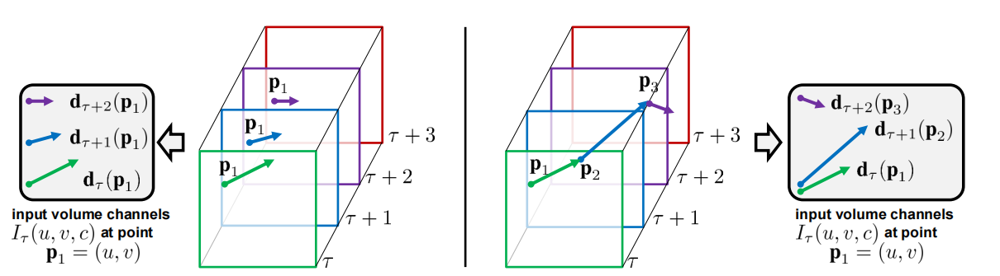

# 双流卷积网络：视频动作识别的里程碑

> Two-Stream Convolutional Networks for Action Recognition in Videos 由牛津大学的 Karen Simonyan 和 Andrew Zisserman 于 2014 年发表在 NeurIPS，首次将"外观"与"运动"信息分流处理，成为视频动作识别领域的经典基线。

## 核心思想：分离"是什么"与"如何动"

在视频中识别动作（如跑步、挥手、弹吉他），需要同时理解两个层面：

- **空间信息**：场景与物体的外观——回答"是什么"
- **时间信息**：物体的运动模式——回答"怎么动"

传统 CNN 在静态图像识别上表现出色，但直接逐帧处理视频时难以捕捉运动信息。为此，论文提出了**双流（Two-Stream）架构**，将视频内容分解为两条独立且互补的处理流。

## 架构详解

### 空间流（Spatial Stream ConvNet）

- **输入**：视频中随机抽取的**单帧 RGB 图像**
- **任务**：识别画面中的场景和物体（篮球、篮筐、球员等）
- **网络**：标准 CNN（如 ImageNet 预训练的 AlexNet/VGG），结构为 conv1 → conv5 → full6 → full7 → softmax
- **输出**：基于静态画面的动作分类分数
- **局限**：仅凭单帧难以区分"正在跳投"与"静态站立"

### 时间流（Temporal Stream ConvNet）

- **输入**：连续多帧（如 10 帧）计算出的**密集光流（Dense Optical Flow）**
- **任务**：识别运动模式（手臂挥动轨迹、腿部奔跑模式等）
- **网络**：与空间流结构几乎相同的 CNN，但专门学习时序运动特征
- **输出**：基于运动模式的动作分类分数

**光流**可以理解为一张"运动地图"：它描述前一帧每个像素在下一帧移动到了哪里，只包含运动方向和速度，不包含颜色或纹理。光流图中，运动幅度越大的区域越亮（如快速摆动的脚踝），静止的背景则呈现为暗色。

### 分数融合（Late Fusion）

两个流各自独立完成预测后，通过**后期融合**将两组分类分数进行加权平均，得到最终结果。例如：

- 空间流看到游泳池 → 猜测"游泳"或"跳水"
- 时间流捕捉到身体下坠和划水的运动模式
- 融合后模型自信地判定为"游泳"

这种设计将复杂的视频识别问题分解为两个可以用标准 2D CNN 解决的子问题，综合"看到什么"与"如何运动"两种信息，显著提升了识别准确率。

## 光流的输入表示

### 光流堆叠

输入为两帧 $240 \times 320$ 的图像，计算得到 $240 \times 320 \times 2$ 的光流场（水平方向 $d_x$ 和垂直方向 $d_y$ 各一个通道）。将连续 $L$ 帧的光流场堆叠为 $2L$ 个通道的"伪图像"送入时间流 CNN。

### 固定位置的光流堆叠（Naive Stacking）

这是本文采用的基础方法：

1. 选择一个固定的像素位置 $\mathbf{p}_1 = (u, v)$
2. 在时间 $\tau$ 计算该点的光流 $\mathbf{d}_\tau(\mathbf{p}_1)$（从 $\tau$ 帧到 $\tau+1$ 帧的运动）
3. 在时间 $\tau+1$，**仍然在 $\mathbf{p}_1$ 这个固定位置**计算光流 $\mathbf{d}_{\tau+1}(\mathbf{p}_1)$
4. 以此类推，收集同一空间位置在多个连续时间点上的光流向量
5. 将这些 $(d_x, d_y)$ 值按通道堆叠，形成多通道输入

**缺点**：只能捕捉固定空间区域的运动。如果物体从 $\mathbf{p}_1$ 快速移开，后续帧捕捉到的就是背景或其他物体的运动。

### 沿运动轨迹的光流堆叠（Trajectory Stacking）

这是一种改进方法，能更准确地捕捉物体的长期运动：

1. 选择起始像素位置 $\mathbf{p}_1$
2. 在时间 $\tau$ 计算 $\mathbf{p}_1$ 的光流 $\mathbf{d}_\tau(\mathbf{p}_1)$，并预测该点在下一帧的新位置 $\mathbf{p}_2 = \mathbf{p}_1 + \mathbf{d}_\tau(\mathbf{p}_1)$
3. 在时间 $\tau+1$，**跟随到新位置 $\mathbf{p}_2$**，计算该点的光流 $\mathbf{d}_{\tau+1}(\mathbf{p}_2)$，预测下一帧位置 $\mathbf{p}_3$
4. 不断重复，形成一条**运动轨迹（Trajectory）**
5. 将轨迹上收集到的所有光流向量 $\mathbf{d}_\tau(\mathbf{p}_1), \mathbf{d}_{\tau+1}(\mathbf{p}_2), \mathbf{d}_{\tau+2}(\mathbf{p}_3), \dots$ 堆叠作为输入

**优点**：可以"跟随"移动的物体，捕捉连贯完整的运动信息，对理解挥杆、投掷等持续时间较长的动作至关重要。

## 训练技巧（Implementation Details）

### 数据增强

- **全图随机裁剪**：将短边缩放到 256 像素后，从画面**任意位置**随机裁剪 $224 \times 224$ 区域（而非仅裁剪中心），大幅增加数据多样性。作者指出这是其 ImageNet 预训练取得更好性能的主要原因。
- **随机水平翻转 + RGB 颜色抖动**：进一步提升模型鲁棒性。

### 测试时增强

采用密集采样策略获取更稳定的预测：

1. **时间维度**：从视频中均匀采样 25 帧
2. **空间维度**：对每帧提取 10 个切片（四角 + 中心，及其水平翻转）
3. **最终预测**：$25 \times 10 = 250$ 个预测分数取平均

### 光流压缩

原始光流数据为 float32 浮点数，存储量巨大。以 UCF-101 数据集为例，一帧 $320 \times 240$ 的光流场大小约为：

$$320 \times 240 \times 2 \times 4 \approx 614 \text{ KB}$$

整个数据集超过 130 万帧，总存储需求达到 TB 级别。论文采用两步压缩策略：

**第一步：线性缩放（浮点数 → 整数）**

将光流的 $d_x$、$d_y$ 分量从浮点数范围（如 $[-20, 20]$）线性映射到 $[0, 255]$ 的 uint8 整数：

$$\text{整数值} = \text{round}\left(\frac{\text{浮点值} - (-20)}{20 - (-20)} \times 255\right)$$

两个通道独立缩放，得到两张灰度图。仅此一步，存储空间就缩减为原来的 $\frac{1}{4}$。代价是浮点精度的微小损失，但实践证明对动作识别影响不大。

**第二步：JPEG 压缩（整数 → 压缩文件）**

将两个通道的灰度图分别保存为 JPEG 格式。JPEG 的核心假设——相邻像素值高度相关、图像平滑连续——同样适用于光流场：运动物体内部像素的运动方向和速度相似，光流场平滑且连续，仅在物体边缘才出现剧烈变化。

JPEG 压缩率通常可达 10 倍以上，结合第一步的 4 倍压缩，**总压缩率约 55 倍**（从 1.5 TB 降至约 27 GB）。

训练时过程可逆：读取 JPEG → 解压为 $[0, 255]$ 整数矩阵 → 反向线性缩放恢复到近似原始浮点数范围 → 送入网络。

### 双向光流

论文在实验中还使用了**双向光流**：对每一对相邻帧 $(t, t+1)$，同时计算前向光流和后向光流，然后一起堆叠作为输入。

- 单向光流：堆叠 $L = 10$ 帧，输入通道数为 $10 \times 2 = 20$
- 双向光流：输入通道数为 $10 \times (2 + 2) = 40$

### 多 GPU 并行训练

修改 Caffe 框架实现数据并行，将 mini-batch 分配到 4 个 GPU 同时训练，获得 3.2 倍加速。

## 延伸：三大核心概念对比

| 特性 | Bi-directional（双向） | Pyramid（金字塔） | Cascade（级联） |
|:---|:---|:---|:---|
| **核心思想** | "瞻前顾后"：将信息从前到后和从后到前处理两遍，获得完整上下文 | "远近高低"：将数据在多个尺度或分辨率上表示，捕捉不同大小的目标 | "层层筛选"：设计由简到繁的多级过滤器，快速淘汰绝大多数"容易"的负样本 |
| **主要解决的问题** | 单向序列模型无法利用未来信息来理解当前内容 | 物体在图像中因远近而呈现不同大小，导致检测失败 | 在"目标稀疏"的场景下，用复杂模型检查所有候选区域非常耗时 |
| **实现方式** | 使用两个独立的 RNN/LSTM，一个正向一个反向处理序列，将输出拼接或合并 | 图像金字塔：对原始输入反复降采样生成多分辨率副本；特征金字塔（FPN）：融合 CNN 不同深度的特征图 | 设计一连串分类器，前级简单快速、后级复杂精准，样本必须通过所有前级才能送入后级 |
| **主要优点** | 极大提升上下文理解能力，在多数序列任务上精度更高 | 实现对不同大小目标的检测（尺度不变性），提升特征鲁棒性 | 极大提升检测速度和效率，将计算资源集中于少数"困难"样本 |
| **缺点/限制** | 计算量约为单向模型的两倍，无法用于实时流式预测 | 图像金字塔计算成本高昂；特征金字塔增加了网络设计的复杂性 | 训练过程相对复杂，需要逐级调参，前级分类器的性能会影响最终结果 |
| **经典应用** | Bi-LSTM（命名实体识别、情感分析）；BERT（Masked LM 机制是深度双向的）；机器翻译中 Attention 常与 Bi-LSTM 结合 | SIFT 特征（经典多尺度特征点算法）；Viola-Jones 检测器（多尺度人脸检测）；FPN（现代目标检测的标配） | Viola-Jones 人脸检测器（级联思想最成功的应用）；Cascade R-CNN（现代目标检测中提升定位精度的有效方法） |
