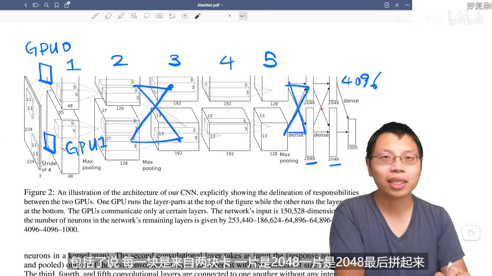
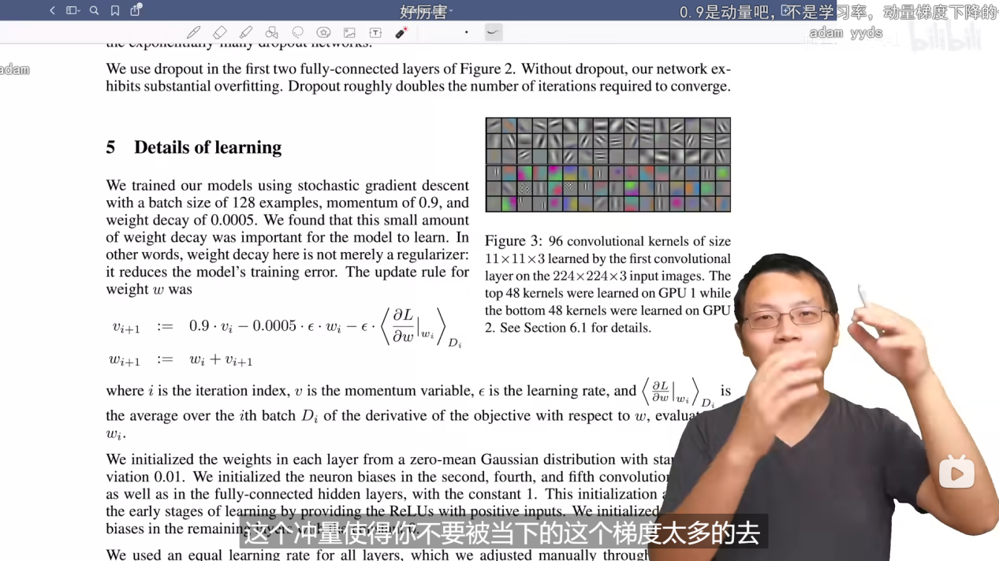
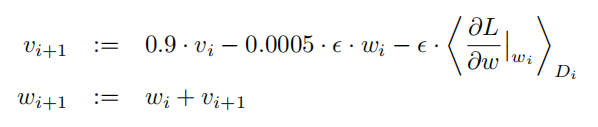
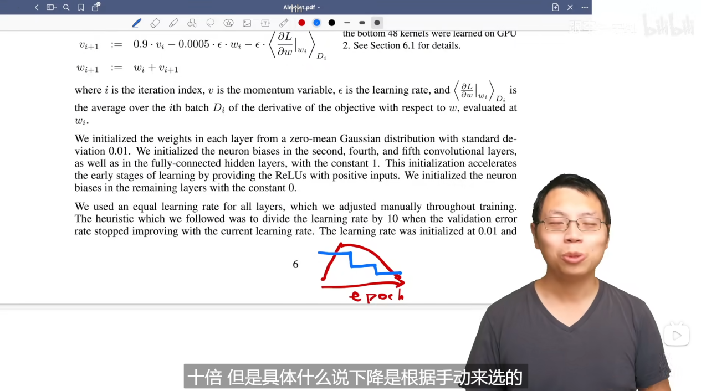
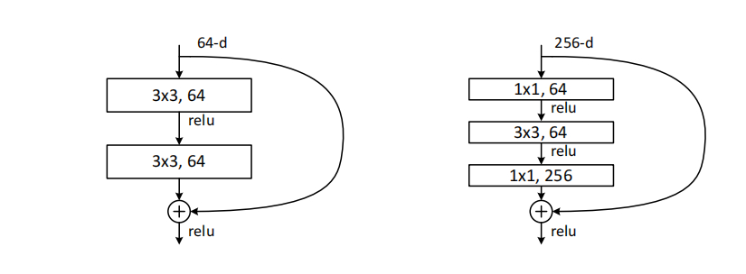

# ViLT：去掉卷积的视觉语言 Transformer

> ViLT 是首个将视觉嵌入计算量压缩到可忽略不计的视觉语言预训练模型，通过 Patch Projection 替代传统的 CNN/目标检测器，将推理速度提升了数十倍，同时保持了有竞争力的下游任务性能。

## 背景：传统 VLP 模型的瓶颈

在 ViLT 出现之前，主流的视觉与语言预训练模型严重依赖笨重的视觉编码器，通常使用在 Visual Genome 上预训练的物体检测器提取区域特征。

上图展示了三种模型在推理时间上的差异：UNITER-Base 依赖 Faster R-CNN，Pixel-BERT-R50 依赖 ResNet，而 ViLT-B/32 仅使用 Patch Projection，使视觉嵌入耗时降到约 0.4ms。

## ViLT 的核心贡献

ViLT 提出了一种极简的 VLP 范式，完全移除了卷积网络和区域监督，将图像切成 patch 后直接做线性映射，再与文本 token 一起送入统一 Transformer。

## 模型架构

### 输入嵌入

每个 token 的嵌入由类型嵌入、位置嵌入和内容嵌入相加得到：

$$
\text{Token Embedding} = \text{Type Embedding} + \text{Position Embedding} + \text{Content Embedding}
$$

### 多模态交互

两个模态的嵌入分别加上模态类型嵌入后拼接：

$$
z^0 = [\bar{t} + t^{type};\; \bar{v} + v^{type}]
$$

ViLT 使用 ViT 风格的 pre-norm Transformer：

$$
\hat{z}^d = \text{MSA}(\text{LN}(z^{d-1})) + z^{d-1}
$$

$$
z^d = \text{MLP}(\text{LN}(\hat{z}^d)) + \hat{z}^d
$$

最终池化表示为：

$$
p = \tanh(z_0^D W_{pool})
$$

## 预训练目标

ViLT 的主要目标包括 ITM、MLM 和 WPA。WPA 通过最优传输距离促进文本 token 与图像 patch 的细粒度对齐。

## 关键训练细节

- 整词掩码避免模型仅依赖局部 subword 上下文“作弊”
- 训练和微调可使用图像增强
- 使用较低分辨率图像进一步提升效率

## 专题：CLIP 改进串讲

CLIP 采用双塔编码器和对比学习目标，而 ViLT 采用单流融合和联合建模，两者代表了多模态预训练中的两条不同路线。
