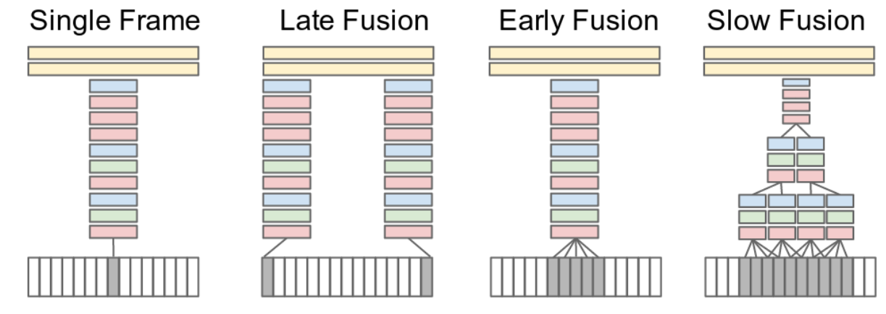
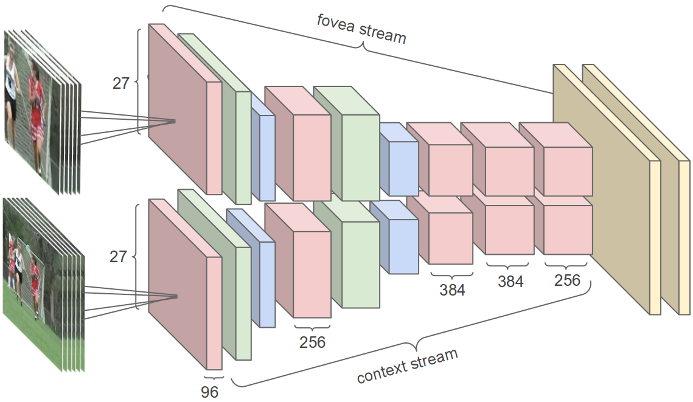
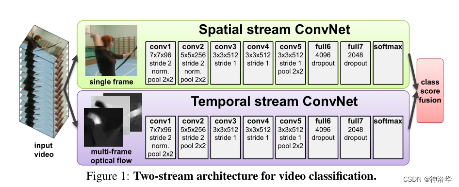
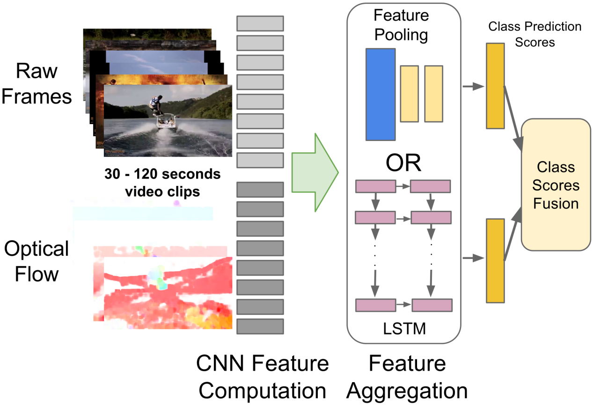
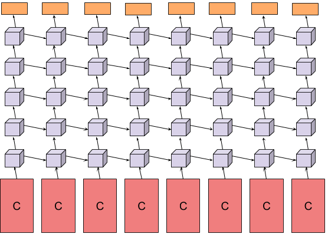
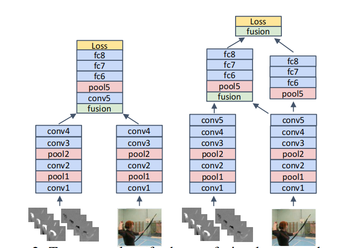
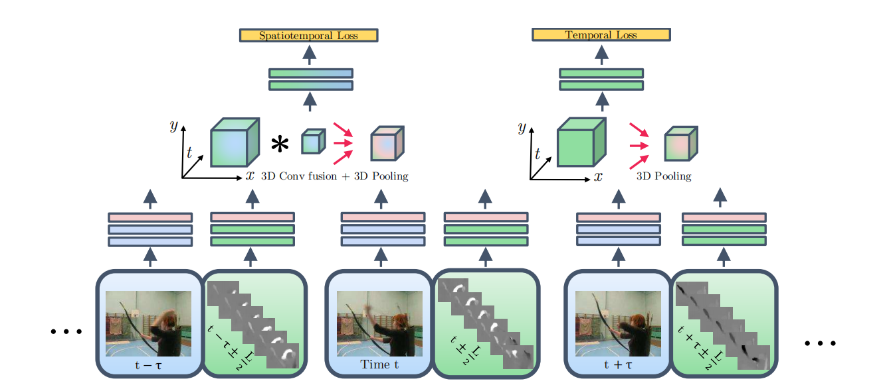

# 视频理解经典方法串讲：从 DeepVideo 到 Two-Stream，再到 Early Fusion

> 本文串讲视频理解早期三篇代表性工作：Karpathy 等人的 DeepVideo 首次系统比较了 CNN 处理视频的多种融合方式；Simonyan 与 Zisserman 提出的 Two-Stream 将视频理解拆解为外观与运动两条通路；Feichtenhofer 等人的 Early Fusion 则进一步回答了“双流网络应该如何融合、在哪里融合、时间维度如何融合”这三个关键问题。

## 1. DeepVideo：CNN 处理视频的早期探索

DeepVideo 对应论文 *Large-scale Video Classification with Convolutional Neural Networks*（Karpathy et al., CVPR 2014）。这项工作的重要性不在于最终精度有多高，而在于它第一次较系统地回答了一个基础问题：**如果把视频帧交给 CNN，到底应该在哪一层引入时间信息？**

### 1.1 四种融合策略

论文比较了四种典型思路：

- **Single Frame**：从视频中任选一帧送入 CNN，完全不利用时序信息，是最简单的静态图像基线。
- **Late Fusion**：抽取两帧分别通过权重共享的 CNN，最后在输出层融合分类结果。
- **Early Fusion**：在输入阶段将多帧沿通道维拼接，让网络从第一层开始同时看到多帧。
- **Slow Fusion**：在网络中间层逐步融合多帧特征，让时间信息在更深层语义上汇聚。

这四种方式本质上对应同一个设计维度：**时间信息到底是在输入层、输出层，还是中间特征层进入网络。**

### 1.2 多分辨率策略

作者还尝试了多分辨率输入。具体做法是使用两个权重共享的网络，分别处理原图与 center crop 图像：

- 一路更关注全局上下文
- 一路更关注中心区域细节

这种方式大约带来 1 个百分点左右的精度提升，说明视频理解不只是“时间怎么建模”，空间尺度信息同样重要。

### 1.3 实验发现与局限

DeepVideo 最耐人寻味的结论是：**这四种融合方式的最终效果差异并不大。** 即使在 Sports-1M 这种百万级视频数据集上预训练，再在 UCF-101 上微调，准确率也只有约 65%，仍然明显落后于当时精心设计的手工特征方法。

这说明在当时的技术条件下，简单地把多帧堆给 2D CNN，并不足以让网络真正学到有效的时序动态。它更多证明了两件事：

1. 用 CNN 直接处理视频是可行的研究方向；
2. 仅靠“堆帧”仍然不够，视频中的运动信息需要更明确的建模方式。

从历史角度看，DeepVideo 的价值主要有两点：

- **方法论价值**：系统探索了时间信息进入 CNN 的不同层级；
- **数据集价值**：提出了 Sports-1M，为大规模视频学习提供了训练基础。

## 2. Two-Stream：把“看到什么”与“怎么运动”分开建模

Two-Stream 对应论文 *Two-Stream Convolutional Networks for Action Recognition in Videos*（Simonyan & Zisserman, NeurIPS 2014）。这篇工作的核心突破在于，它不再把视频简单视为“多帧图像堆叠”，而是明确提出：**动作识别需要同时理解静态外观与动态运动。**

### 2.1 双流网络基本架构

Two-Stream 将视频理解拆成两条并行通路：

- **空间流（Spatial Stream）**：输入单帧 RGB 图像，建模场景、物体、姿态等外观信息；
- **时间流（Temporal Stream）**：输入连续多帧光流堆叠，建模速度、方向和运动模式。

最终，两条流在 softmax 分数层做 **Late Fusion**，得到视频类别预测。这个设计非常朴素，但极其有效，因为它明确承认：

- 单帧图像适合回答“画面里有什么”；
- 连续运动信息适合回答“目标是怎么动的”。

### 2.2 为什么双流有效

对于很多动作类别，单帧外观并不足以区分类别。例如挥手、投掷、击球、游泳等动作，在某个静态时刻看起来可能非常相似，真正的差异存在于时间维度上的运动轨迹。

Two-Stream 的关键判断是：**外观与运动属于两种统计特性不同的信号，最好分开建模，再在决策层汇合。** 这让模型既能复用成熟的图像 CNN，又能显式把运动作为独立输入纳入学习。

### 2.3 四个主要改进方向

原始双流网络建立之后，研究者很快意识到它还有明显提升空间，主要包括四个方向：

1. **特征层融合**：从分数层融合继续推进到中间特征层融合；
2. **更强的 backbone**：用更深、更强的 CNN 替换早期网络；
3. **引入序列模型**：在 CNN 特征之上叠加 LSTM 等时序模型；
4. **覆盖更长时间范围**：原始时间流只使用短时间窗口，难以处理长视频。

### 2.4 特征聚合与 LSTM

针对长视频场景，一个自然思路是：先用 CNN 逐帧抽取特征，再通过 Pooling 或 LSTM 在时间轴上聚合这些特征。

论文探索了多种 pooling 方式，整体差异不大，其中 conv pooling 略优。更进一步的做法，是用 LSTM 替代简单 pooling，让模型显式学习特征序列中的时序依赖。

在这类结构中，CNN 提取出的帧级特征会按时间顺序送入 LSTM，最终再通过 softmax 进行分类。它对应的思路是：

- CNN 负责提空间语义；
- LSTM 负责建模时间上的演化关系。

### 2.5 实验结论

一个非常重要的经验是：**LSTM 在 UCF-101 这类短视频数据集上的收益并不明显。** 原因在于短视频中的语义变化幅度往往有限，相邻时间步输入差异不大，LSTM 很难学到足够强的时序模式。

这件事说明：并不是“加一个时序模型”就一定有效，时序建模是否能发挥作用，还取决于视频长度、动作节奏和训练数据规模。

## 3. Early Fusion：双流网络究竟应该怎么融合

Early Fusion 对应论文 *Convolutional Two-Stream Network Fusion for Video Action Recognition*（Feichtenhofer et al., CVPR 2016）。如果说 Two-Stream 已经解决了“要不要把外观与运动分开建模”，那么 Early Fusion 继续追问的是三个更细的问题：

1. **如何融合（how）**
2. **在哪里融合（where）**
3. **时间维度怎么融合（when / temporal modeling）**

### 3.1 问题背景

原始 Two-Stream 的 Late Fusion 可以写成：

$$
P = \frac{1}{2}(P_{\text{spatial}} + P_{\text{temporal}})
$$

这种做法简单稳定，但也有明显限制：两条流直到最后才发生交互，中间层丰富的特征关系被浪费了。于是作者转而研究：能否在卷积特征层、更早地让两条流发生可学习的交互。

### 3.2 空间融合（Spatial Fusion）

论文设融合层接收两条流的特征图 $x_t^a$ 和 $x_t^b$，输出融合特征 $y$。作者比较了五种典型方式：

- **Sum Fusion**：$y^{sum} = x_t^a + x_t^b$
- **Max Fusion**：$y^{max} = \max(x_t^a, x_t^b)$
- **Concatenation Fusion**：$y^{cat} = \text{cat}(x_t^a, x_t^b)$
- **Conv Fusion**：$y^{conv} = y^{cat} * f + b$
- **Bilinear Fusion**：对对应位置的特征做更强的乘性交互

这几种方法分别代表了从“固定规则融合”到“可学习融合”的不同复杂度。直观上看：

- Sum / Max 更简单，但表达力有限；
- Concatenation 只是把信息放在一起；
- Conv Fusion 能学习“应该保留哪些通道、抑制哪些通道”；
- Bilinear Fusion 交互更强，但代价更高。

### 3.3 融合位置（Where to Fuse）

除了“怎么融合”，论文还研究了“在哪一层融合”。实验表明，两种策略效果较好：

- **在 conv5 之后融合**：让两条流各自先提取较高层语义，再共享后续层；
- **类似残差连接的融合方式**：融合后仍保留一定的分支独立性。

这个结论很重要，因为它说明融合层级不能太早也不能太晚：

- 太早，特征仍然过于低层，语义不足；
- 太晚，又退化成原始的 late fusion。

### 3.4 时间融合（Temporal Fusion）

时间维度上的问题是：当我们已经拿到多个时间点的特征之后，应该怎样把它们融合起来？论文比较了三种做法：

- **2D Pooling**：基本忽略时序结构，只做普通池化；
- **3D Pooling**：把特征沿时间轴堆叠后再池化；
- **3D Conv + 3D Pooling**：先通过 3D 卷积学习时空联合特征，再做 3D 池化。

其中效果最好的是 **3D Conv + 3D Pooling**，因为它不只是“聚合时间信息”，而是真正去学习时间维与空间维之间的联合模式。这实际上已经在思想上非常接近后来的 I3D、SlowFast 和其他 3D 视频模型。

### 3.5 完整架构

论文最终采用的是一个更完整的时空融合框架。其大致流程可以概括为：

1. 在多个时间点对视频做分层采样；
2. 对每个时间点分别提取 RGB 外观特征和光流运动特征；
3. 在合适的卷积层做空间融合；
4. 再沿时间轴堆叠并施加 3D 卷积 / 3D 池化；
5. 用双分支损失分别监督时空融合分支和纯时间分支；
6. 推理时对多个分支输出做加权平均。

这个结构的核心思想是：**不要等到最后才融合，而要尽早让外观与运动发生特征级交互，并在时间轴上继续学习联合表示。**

### 3.6 实验结论

Early Fusion 在 UCF-101 上带来小幅提升，但在 HMDB-51 这类数据较小的数据集上提升更明显。一个合理解释是：更早的时空融合相当于给模型加入了一种更强的结构先验，有助于在数据不足时限制模型搜索空间、提升泛化效果。

从方法演进角度看，Early Fusion 的价值在于它把双流网络从“分数融合范式”推进到了“特征融合范式”。

## 4. 三篇工作的演进关系

把这三篇论文放在一起看，可以看到一条非常清晰的方法演进主线：

- **DeepVideo**：回答“多帧视频怎样喂给 CNN”，证明简单堆帧可以做，但还不够；
- **Two-Stream**：回答“视频为什么必须显式建模运动”，把外观与运动拆成两条流；
- **Early Fusion**：回答“双流网络不应只在最后融合，而应在特征层和时间维更早融合”。

也就是说，这条发展路径的核心不是网络越来越复杂，而是研究问题越来越清晰：

1. 时间信息能否进入 CNN？
2. 时间信息是否应该与空间信息分开表示？
3. 分开表示之后，应该如何更有效地重新融合？

这条思路最终自然通向后来的 3D CNN、TSN、I3D、SlowFast，以及更现代的 Video Transformer。

## 参考文献

- Karpathy, A., Toderici, G., Shetty, S., Leung, T., Sukthankar, R., & Li, F. F. (2014). *Large-scale Video Classification with Convolutional Neural Networks*. CVPR 2014.
- Simonyan, K., & Zisserman, A. (2014). *Two-Stream Convolutional Networks for Action Recognition in Videos*. NeurIPS 2014.
- Feichtenhofer, C., Pinz, A., & Zisserman, A. (2016). *Convolutional Two-Stream Network Fusion for Video Action Recognition*. CVPR 2016.
