# Swin Transformer

摘要

1.  尺度变化巨大 (Large variations in the scale of visual
    entities)：图像中的物体或视觉元素尺寸不一，比如一个微小的物体和一整片背景，这对于标准Transformer的单一尺度处理机制来说是个难题。

2.  高分辨率图像带来的巨大计算量 (High resolution of
    images)：如果直接将Transformer应用于高分辨率图像的每个像素，其自注意力机制的计算复杂度会与图像尺寸的平方成正比（O(N^2
    )），这在计算上是难以承受的。

    为了解决这些问题，论文提出了Swin
    Transformer。其核心设计思想体现在它的名字中：

    层级式特征图 (Hierarchical Feature
    Maps)：与传统的卷积神经网络（CNN）类似，Swin
    Transformer能够构建层级式的特征表示。它通过在网络的深层逐步合并图像块（patches）来减小特征图的分辨率，从而可以方便地与现有的各种下游视觉任务（如检测、分割）进行对接。

    移动窗口计算自注意力 (Shifted Windows)：为了降低计算量，Swin
    Transformer没有在整个特征图上计算全局自注意力，而是在不重叠的局部窗口（non-overlapping
    local windows）内计算。更关键的是，它引入了移动窗口（shifted
    window）机制，使得信息可以在相邻的窗口之间进行交互，从而实现了跨窗口的连接，间接达到了全局建模的效果。这种设计在保持强大建模能力的同时，实现了与图像尺寸成线性的计算复杂度。

    摘要的核心贡献点是：Swin
    Transformer是一种新的视觉Transformer架构，它通过构建层级式特征图和使用基于移动窗口的局部自注意力机制，成功地解决了标准ViT在处理视觉任务时的尺度和计算量问题，使其成为一个高效且强大的通用视觉骨干网络。论文最后提到，Swin
    Transformer在图像分类、目标检测和语义分割等主流视觉任务上都达到了当时的最佳（State-of-the-art）性能。

    引言

    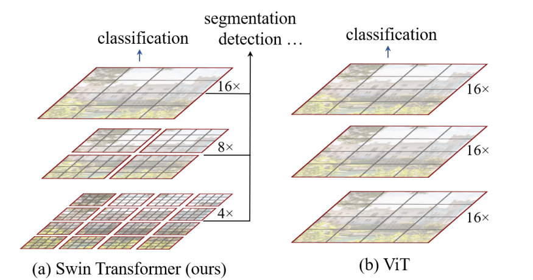

    **Swin
    Transformer通过“窗口”这个单位来约束计算，而ViT是基于“Patch”这个单位进行全局计算。**

    ViT的复杂度与 (总Patch数)² 成正比。

    Swin Transformer的复杂度与 总窗口数
    成正比（因为每个窗口内的计算量是固定的）。

    多尺度的特征十分重要（感受野不同），对于目标检测而言，抓住不同物体不同尺寸的特征，对于检测物体是有很大帮助的。

    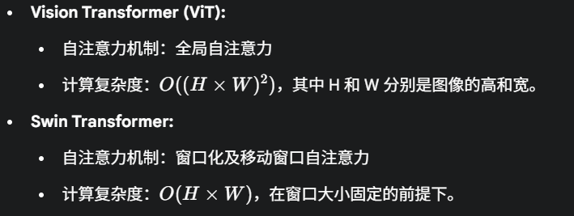

    VIT的patch_size是不变的。他始终在全图（这个窗口）建模，当图片尺寸放大一倍，patch数量增加一倍，复杂度和图像尺寸成平方倍的增长。

    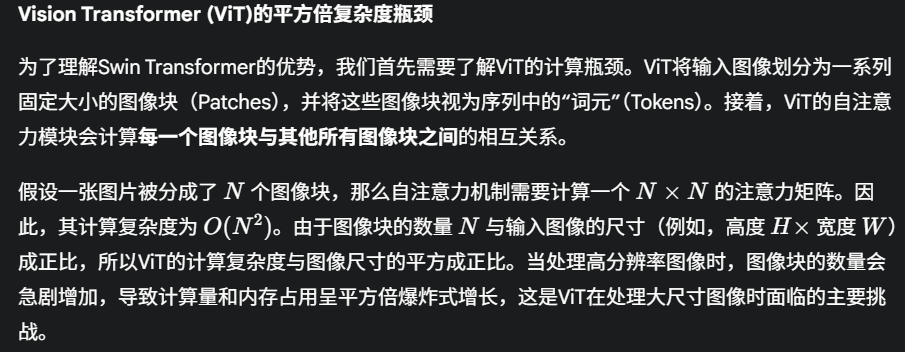

Swin Transformer
把图划分成很多窗口，只要每个窗口的patch固定，计算复杂度就是固定的。

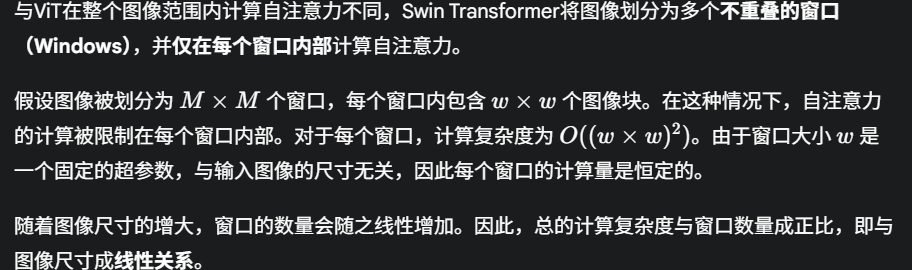

Swin
Transformer通过将计算量巨大的全局自注意力分解为在固定大小的局部窗口内进行计算，并辅以移动窗口机制来保证信息的跨窗口流动，成功地将计算复杂度从与图像尺寸的平方关系转变为线性关系。这一创新使得Transformer架构能够更高效地处理高分辨率图像

**怎么生成多尺度特征？**

卷积神经网络中是池化，Swin transformer中提出了类似的操作，叫做patch
merging(将相邻的patch合并成大的patch)。

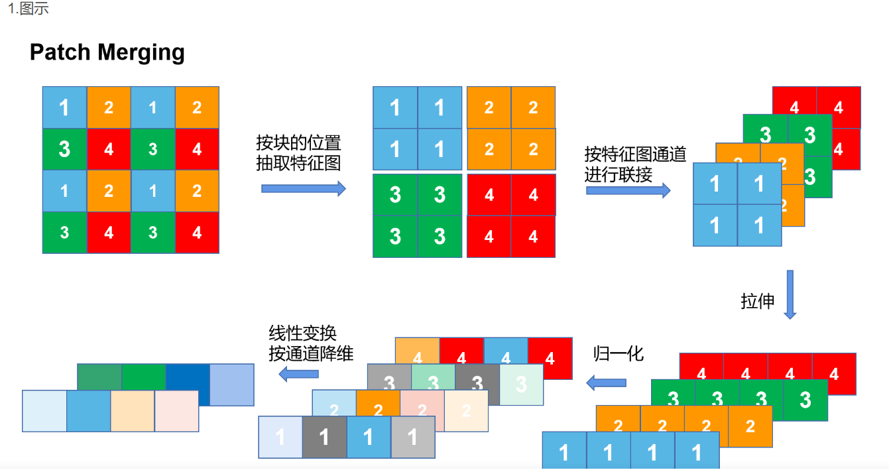

这样我们就得到了多尺度的特征图，就可以输给FPN，就可以做检测。输给U-Net，可以做分割。

怎么进行shift window的？

移动窗口并不是真的在特征图上移动一个“框”，而是通过**将特征图循环位移**（Cyclic
Shift）来实现的。

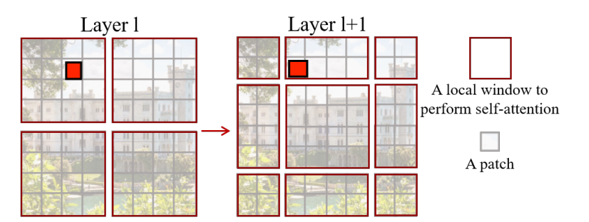

本来红色的只能和第一个窗口里面的patch进行self-attention，现在可以和另一个窗口也进行。（保留了transformer的全局建模能力）

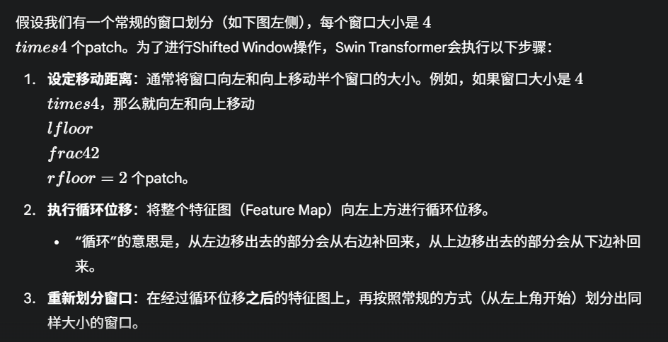

结论：

证明了其通用性：Swin Transformer
不再是一个仅限于图像分类的模型，而是可以作为一个通用、强大且高效的视觉骨干网络
(Backbone)，全面取代了过去由 CNN 主导的地位，为各种视觉任务提供动力。

兼顾了准确性与效率：模型在取得高精度的同时，其线性的计算复杂度使其在处理高分辨率图像时比
ViT 更具优势，展现了在实际应用中的巨大潜力。

1.  浅层特征提取 (Patch Partition & Linear Embedding)

2.  核心特征提取 (4个Stage)：每个Stage由 Patch Merging (可选) 和多个
    Swin Transformer Block 堆叠而成。

3.  分类任务处理 (Final Layers)

4.  分类头 (Classifier Head)

    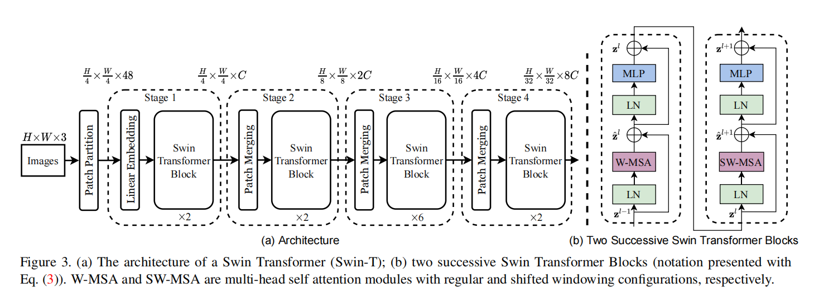

    输入是224\*224\*3，经过Patch Partition: 将输入的 224x224
    图像切割成一个个 4x4 大小、不重叠的图像块（Patch）。Linear
    Embedding: 将每个 4x4
    的图像块展平，并通过一个全连接层（线性层）将其特征维度映射到指定的维度
    C。对于Swin-T，C=96（超参数）。224\*224\*3-\>56\*56\*48-\>56\*56\*96

    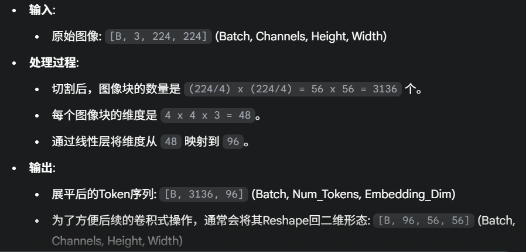

    输出3136\*96，3136太长了，因此引入Swin-T，每个窗口默认是7\*7个patch。

    经过Swin-T（Transformer不改变尺寸输入和输出），尺寸还原为96\*56\*56。

    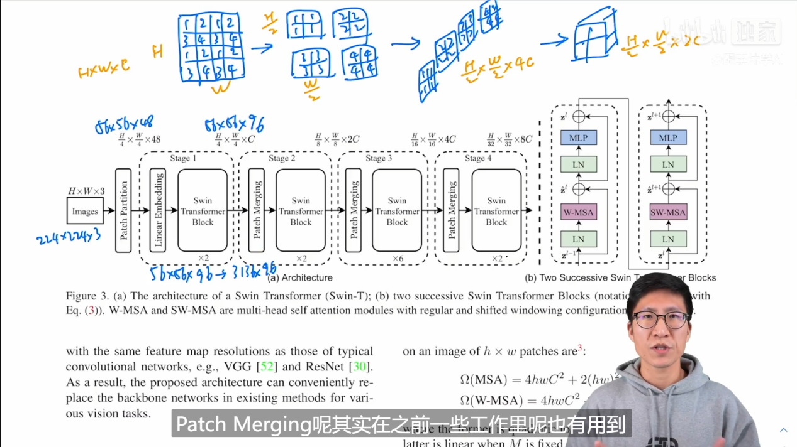

    卷积神经网络里面是pooling（尺寸减少一半，通道数增加一倍）（通道数翻倍是因为卷积而不是pooling，pooling只改变尺寸），Swin-T是patch
    merging。

    怎么得到多尺度的特征图？（蓝色注释部分，pixel shuffle 的反过程）

    对张量先进行采样（每隔一个点采样一次），得到H/2 \*
    W/2的四个小张量，然后进行拼接（H/2 \* W/2 \*
    4）因为CNN+pooling后一般是通道数翻倍，这里再加一个1\*1卷积，是的通道数为2.

    下面几层，56\*56\*96-\>28\*28\*192-\>14\*14\*384-\>7\*7\*768经过Average
    pooling变成1\*768-\>1\*1000（如果是Image-Net），和卷积神经网络十分相似。对于分类任务，采用的方式是加入Average
    pooling（几乎和卷积神经网络一模一样）。图上没有画出来输出头，因为Swin-T用在了多个任务上面。

    **核心创新**

    基于移动窗口的自注意力机制

    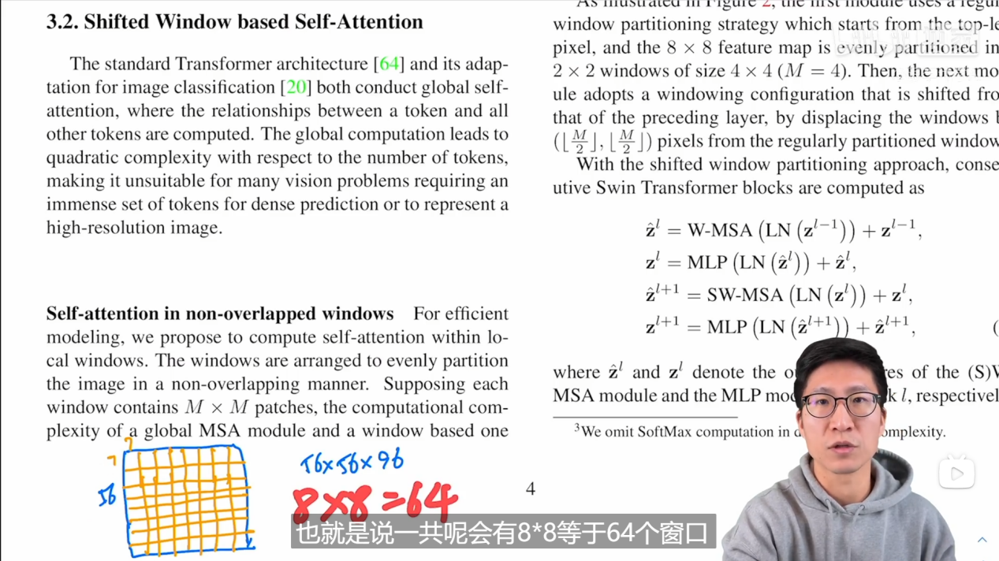

    以第一个输入到Swin-T的输入为例，大小为56\*56\*96。默认窗口大小为7\*7个patch，计算单元最小是patch而不是window（56/7=8\*8）。

    计算复杂度估计:

    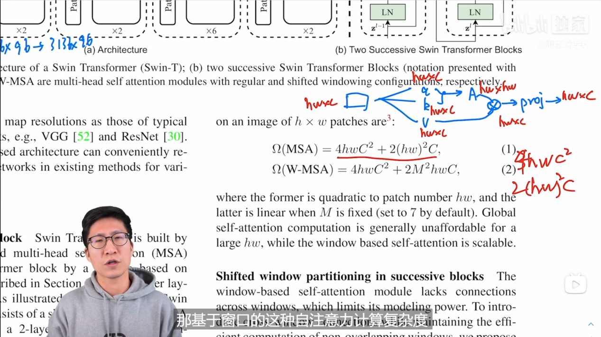

    **原始的transform：**

<!-- -->

1.  (hwc)\*(c\*c) = hwc^2，得到k，q，v，复杂度为3\*hwc^2。

2.  q，k相互作用，得到A，复杂度为(hw)^2\*c。

3.  A,v作用，复杂度为(hw)^2\*c。

4.  最后再乘c\*c的矩阵，复杂度hwc^2。

    相加得到O = 4\*hwc^2+2(hw)^2\*c

    **带窗口的注意力机制：**

<!-- -->

1.  注意力机制从计算h\*w变成了M\*M，窗口数量(h/M,w/M)

2.  将1.带入刚才的计算公式

    O = (h\*w/(M^2))\*4\*(Mc)^2+2(M)^4\*c = 4h\*wc^2 + 2(M^2)hwc

    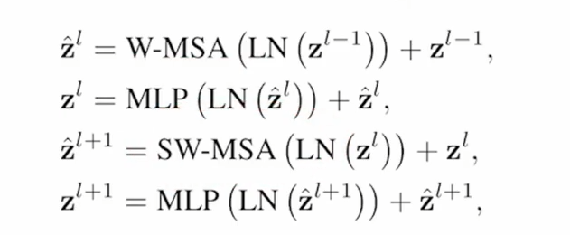

    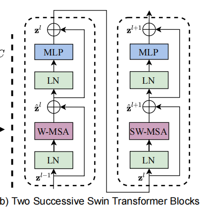

    每次先做一次窗口的MSA（Multi-head self
    Attention），再做移动窗口的SW-MSA，这样就实现了窗口与窗口之间的通信。主要的研究动机就是要有层级式的Transformer（patch
    merging），为了减少复杂度，且能做视觉里面的密集任务，提出了窗口和移动窗口的注意力方式。也就是下图：

    

    多个Swin Transformer block堆叠，构成Swin-T的结构。

    SW-MSA:

    有些问题，初始时候的窗口是4个，移动后变成9个？窗口大小也发生了改变？这时候就没法把窗口压成一个batch，快速进行运算。

    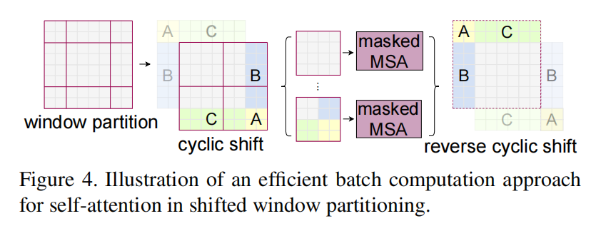

    循环移位，得到cycle
    shift这个图，保证初始是4个窗口，移位后也是4个窗口。不过又引入了新的问题，C如果是图片中的天空，现在拼接到了初始图片下面（地面），按道理来说是没什么关系没必要做注意力的（他们本来是没有挨着的），用masked-SA解决。算完后，之前循环移位的还要再移动回去，因为需要保持原来图片窗口相对位置不变。

    作者太牛了：

    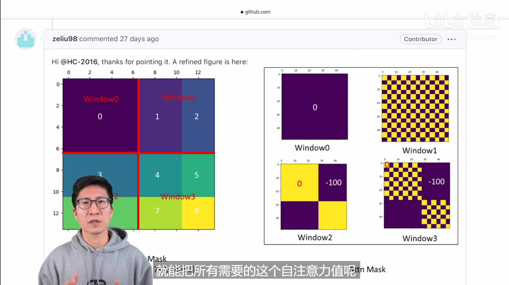

    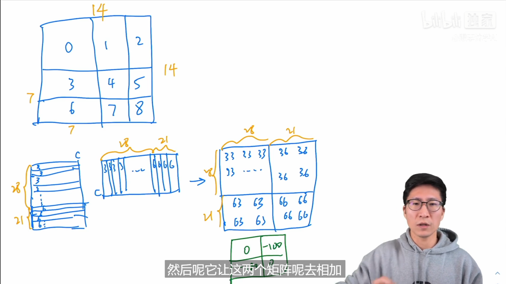

<!-- -->

1.  循环移位后的矩阵。（每个窗口是7\*7个patch，每个patch是像素向量）

2.  每个区域用不用的编号表示，以3，6为例，对于每个窗口，先铺平。

3.  然后进行自注意力的计算 A\*AT，得到49\*49的矩阵B。

4.  （33,66符合，36,63不符合）矩阵B加一个矩阵C（绿色矩阵，符合位置填0，不符合填-100，一个大负数）

5.  Softmax(B+C)，得到计算注意力后的矩阵。Softmax(大负数)=0，也就实现了masked.

Swin Transformer (Shifted Window)
应运而生。它通过两大创新解决了上述问题：

1.  层级式特征图 (Hierarchical Feature Maps)： 像 CNN (如 ResNet)
    一样，Swin Transformer 通过“Patch
    Merging”层逐步降低特征图分辨率、增加通道数，构建出一个层级金字塔。这使其能轻松接入现有的检测（FPN）和分割（U-Net）框架。

2.  基于“窗口”的局部注意力 (Windowed Self-Attention)：
    它不计算全局注意力，而是将注意力计算限制在不重叠的 局部窗口
    内。这使计算复杂度从 （二次方）降低到 （线性）。

3.  移动窗口 (Shifted Windows, SW-MSA)：
    为了解决局部窗口之间缺乏信息交流的问题，Swin Transformer 在连续的
    Transformer Block 之间交替使用“常规窗口” (W-MSA) 和“移动窗口”
    (SW-MSA)，实现了跨窗口的信息连接。

    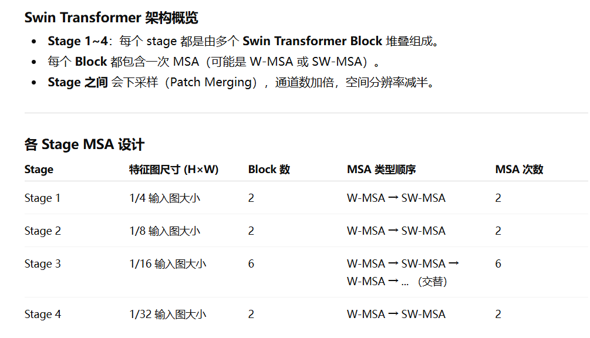

